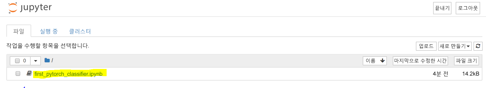
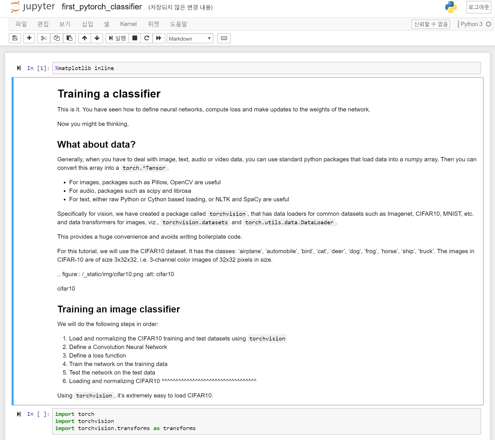

## PyTorch 및 Jupyter를 사용하여 첫 번째 심층 학습 모델 학습시키기

 

심층 학습 엔지니어는 대개 모든 행렬 대수 연산을 수동으로 하드 코드하지 않으며, 대신 PyTorch나 TensorFlow 등의 프레임워크를 사용합니다.  

PyTorch는 유연한 심층 학습 개발 플랫폼으로 사용 가능한 python 기반 프레임워크입니다. PyTorch의 워크플로는 python의 공학용 컴퓨팅 라이브러리인 nympy를 기반으로 작성됩니다. 

그렇다면 PyTorch를 사용하여 심층 학습 모델을 작성하는 이유는 무엇일까요?  

- 간편하게 사용 가능한 API - PyTorch는 매우 단순한 python 기반 프레임워크입니다.
- python 지원 – PyTorch는 공학용 컴퓨팅 스택과 원활하게 통합됩니다.
- 동적 계산 그래프 – PyTorch는 특정 기능을 포함하는 미리 정의된 그래프를 제공하는 대신, 런타임에 수정 가능한 계산 그래프를 동적으로 작성합니다. 동적 계산 그래프는 중첩 일괄 처리를 수행할 때, 그리고 지정된 네트워크를 만드는 데 필요한 메모리의 양을 모를 때 매우 유용합니다.

## 첫 번째 PyTorch 모델 실행

마지막 장에서 설정한 Jupyter Notebook으로 이동합니다.

- [[DSVM의 호스트 이름]].westus2.cloudapp.azure.com:8888/?token={토큰}

first_pytorch_classifier.ipynb Notebook을 선택합니다.

Notebook의 지침에 따라 첫 번째 PyTorch 분류자를 학습시킵니다.

