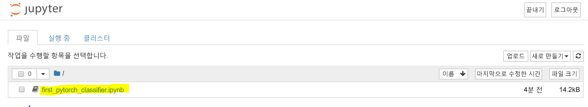

 

일반적으로 심층 학습 엔지니어는 모든 행렬 대수 연산을 수동으로 구현하지 않습니다. 대신 PyTorch나 TensorFlow 등의 프레임워크를 사용합니다.  

PyTorch는 유연한 심층 학습 개발 플랫폼으로 사용 가능한 python 기반 프레임워크입니다. PyTorch는 Python 공학용 컴퓨팅 라이브러리인 NumPy를 기반으로 빌드됩니다. 

그렇다면 왜 PyTorch를 사용하여 심층 학습 모델을 빌드하나요?  

- 사용하기 쉬운 API - Python을 안다면 신속하게 이해할 수 있습니다.
- Python 지원 – PyTorch는 공학용 컴퓨팅 스택과 원활하게 통합됩니다.
- 동적 계산 그래프 – PyTorch는 특정 기능을 포함하는 미리 정의된 그래프를 제공하는 대신, 런타임에 수정 가능한 계산 그래프를 동적으로 빌드합니다. 동적 계산 그래프는 중첩 일괄 처리를 수행할 때, 그리고 지정된 네트워크를 만드는 데 필요한 메모리의 양을 모를 때 매우 유용합니다.

PyTorch에 대한 자세한 내용은[PyTorch.org 공식 설명서](https://pytorch.org/about/)를 참조하세요.

## 첫 번째 PyTorch 모델 실행

이제 PyTorch 이미지에서 프로비전된 Docker 컨테이너가 있으므로 실험할 때가 됐습니다. 앞서 언급한 대로 [python.org](https://python.org)에서 노트북을 다운로드했습니다. 해당 샘플 노트북은 이미지를 여러 범주로 분류하기 위해 네트워크 학습을 안내합니다. 또한 심층 CNN(나선형 신경망)을 정의합니다.

1. 로컬 브라우저에서 마지막 연습 때 설정한 Jupyter Notebook 서버로 이동합니다. URL은 다음과 같은 형식입니다.

    `<HOSTNAME>.<REGION>.cloudapp.azure.com:8888/?token={sometoken}`

1. 대시보드에서 `first_pytorch_classifier.ipynb` 노트북을 선택합니다.

    

    Notebook의 지침에 따라 첫 번째 PyTorch 분류자를 학습시킵니다.

    

2. 노트북의 맨 위에서 시작하고 순서대로 각 셀을 실행합니다. 다음 사항에 유의하세요.

    - 일부 셀은 실행하는 데 오래 걸립니다. "Python 3" 단어 옆의 노트북의 맨 위에 있는 작은 점을 관찰합니다. 커널이 작업하느라 분주한 경우 점은 어둡게 채워진 원이 됩니다. 작업이 완료될 때까지 해당 방식이 유지됩니다. 
    - 이미지를 분류하기 위해 CNN을 학습하고 있습니다. 네트워크 학습이 완료되면 노트북은 모델에 대해 레이블이 지정된 이미지를 테스트합니다. 각 이미지에 대한 예측을 기록하고 해당 모델의 정확도를 계산합니다. 다음 형식으로 결과가 표시됩니다.

    
    
    - 온라인 [PyTorch 자습서 설명서](https://pytorch.org/tutorials/beginner/blitz/cifar10_tutorial.html)에서 노트북에 대해 자세히 알아볼 수 있습니다.
    
    - 노트북이 끝나면 GPU에 관한 학습에 대해 설명합니다. 이 모듈의 연습을 따라 CPU 기반의 VM을 설정했습니다. 모델이 이 크기여도 괜찮다면 GPU의 학습에서 뚜렷한 향상을 기대할 수 없습니다. GPU가 포함된 가상 머신을 사용하여 모듈을 시도하려는 경우 다음의 두 가지 변경 사항을 수행해야 합니다.
    - GPU 기반의 N-시리즈 VM 크기에서 DSVM을 프로비전합니다.
    - 이전 연습에서 사용한 `docker` 대신 `nvidia-docker`를 사용하여 컨테이너를 만듭니다.