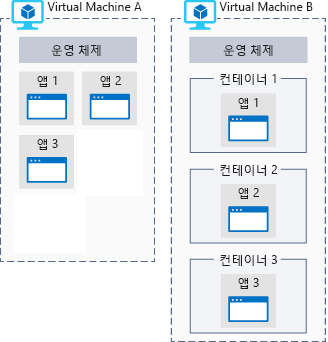

연구 팀에는 Mars에서 검색 될 수 있는 이미지 데이터의 대량 수집 했습니다. 싶지만 계산 집중적인 데이터 처리를 수행 하는 데 필요한 장비를 작업을 수행 했습니다. Azure의 적합 한 데이터 분석을 수행 하는 이유를 확인해 보겠습니다.

## Azure 계산이란?
Azure 계산에는 클라우드 기반 응용 프로그램을 실행 하기 위한 주문형 컴퓨팅 서비스입니다. 가상 머신 및 컨테이너를 통해 멀티 코어 프로세서, 슈퍼 컴퓨터 등의 컴퓨팅 리소스를 제공합니다. 또한 서버 리스 컴퓨팅 인프라 설치 하거나 구성 하지 않고도 앱 실행을 제공 합니다. 리소스는 요청 시 제공되며, 일반적으로 수분 또는 수초 이내에 만들 수 있습니다. 사용하는 리소스에 대해 사용 기간에 대한 요금만 지불하면 됩니다.

Azure에서 계산을 수행하는 일반적인 기술에는 다음 세 가지가 있습니다.

- 가상 머신
- 컨테이너
- 서버리스 컴퓨팅

## 가상 머신이란?

**가상 머신**, 또는 Vm의 경우 물리적 컴퓨터의 소프트웨어 에뮬레이션입니다. VM에는 가상 프로세서, 메모리, 저장소 및 네트워킹 리소스가 포함됩니다. 운영 체제를 호스트하며, 물리적 컴퓨터처럼 소프트웨어를 설치 및 실행할 수 있습니다. 및 원격 데스크톱 클라이언트를 사용 하 여 사용 하 여 고 앉아 있는 앞에 해당 하는 경우에 따라 가상 컴퓨터를 제어할 수 있습니다.

### Azure의 가상 머신

Azure에서 가상 머신을 만들고 호스트할 수 있습니다. 일반적으로 새 가상 컴퓨터 생성 및 미리 구성 된 가상 머신 이미지를 선택 하 여 몇 분 안에 프로 비전 수 있습니다.

이미지를 선택 하면 VM을 만들 때 할 가장 중요 한 결정 중 하나입니다. 이미지는 가상 머신을 만드는 데 사용되는 템플릿입니다. 이러한 템플릿에는 이미 OS(운영 체제)가 포함되어 있으며, 개발 도구 또는 웹 호스팅 환경과 같은 기타 소프트웨어가 포함된 경우도 많습니다.

## 컨테이너란?

> [!VIDEO https://www.microsoft.com/videoplayer/embed/RE2yMhY]

컨테이너는 가상화 환경이지만, 가상 머신과는 달리 운영 체제를 포함하지 않습니다. 대신 컨테이너를 실행하는 호스트 환경의 운영 체제를 참조합니다. 예를 들어 특정 Linux 커널이 있는 서버에서 컨테이너 5개를 실행하는 경우 컨테이너 5개가 모두 동일한 커널에서 실행됩니다.

다음 그림에서는 VM에서 직접 실행 하는 응용 프로그램 및 컨테이너 내에서 VM에서 실행 중인 응용 프로그램 간의 비교를 보여 줍니다.

컨테이너는 일반적으로 작성 하는 응용 프로그램을 포함 &mdash; 호스트 환경의 커널에서 실행 되도록 응용 프로그램에 필요한 모든 라이브러리와 함께 합니다.

컨테이너는 기본적으로 경량이며, 동적으로 생성되고, 확장되고, 중지되도록 설계되었습니다. 이 옵션을 사용 하면 충돌 또는 하드웨어 중단의 경우 신속 하 게 다시 시작 및 요청 시 변경 내용에 응답할 수 있습니다.

컨테이너를 사용 하는 추가적인 이점을 제공 하는 기능 가상 컴퓨터에서 여러 개의 격리 된 응용 프로그램을 실행 합니다. 컨테이너 자체가 보안이 유지되고 격리되므로 워크로드마다 별도의 VM을 만들지 않아도 됩니다.

Azure는 Docker 컨테이너 및 이러한 컨테이너를 관리하는 여러 가지 방법을 지원합니다. 컨테이너는 수동으로 관리하거나, Azure Kubernetes Service와 같은 Azure 서비스를 통해 관리할 수 있습니다.

### 서버리스 컴퓨팅이란?

서버리스 컴퓨팅은 코드를 실행하는, 클라우드에 호스트된 실행 환경이지만 기본 호스팅 환경을 완전히 추상화합니다. 서비스 인스턴스를 만들고 코드를 추가하기만 하면 됩니다. 인프라 구성 또는 유지 관리가 필요하지 않거나 허용되지 않습니다.

> [!VIDEO https://www.microsoft.com/videoplayer/embed/RE2yzjL]

_이벤트_에 응답하도록 서버리스 앱을 구성합니다. 이벤트는 REST 엔드포인트, 일정 간격 타이머 또는 다른 Azure 서비스로부터 받은 메시지일 수 있습니다. 서버리스 앱은 이벤트에 의해 트리거된 경우에만 실행됩니다.

기본적으로, 인프라에는 사용자의 책임 하지 않습니다. 크기 조정 및 성능이 자동으로 처리되며, 사용하는 리소스에 대해서만 요금이 청구됩니다. 용량을 예약할 필요도 없습니다.

Azure에는 다음과 같은 두 가지 서버리스 계산 구현이 있습니다.

- **Azure Functions** 는 거의 모든 최신 언어에서 코드를 실행할 수 있습니다.
- **Azure Logic Apps** - 웹 기반 디자이너에서 설계되며 코드를 작성하지 않고 Azure 서비스에서 트리거한 논리를 실행할 수 있습니다.
