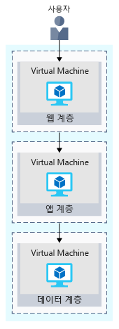
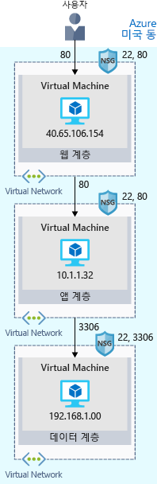

대체로 첫 단계는 클라우드에 온-프레미스 구성을 다시 만드는 것입니다.Your first step will likely be to re-create your on-premises configuration in the cloud.

이 기본 구성은 네트워크가 어떻게 구성되고, Azure에서 어떻게 네트워크 트래픽이 들어오고 나가는지 알려줍니다.This basic configuration will give you a sense of how networks are configured, and how network traffic moves in and out of Azure.

## 전자상거래 사이트 개요Your e-commerce site at a glance

대규모 엔터프라이즈 시스템은 종종 상호 연결되어 함께 작동하는 여러 응용 프로그램과 서비스로 구성됩니다.Larger enterprise systems are often composed of multiple inter-connected applications and services that work together. 인벤토리를 표시하고 고객의 주문 작성을 허용하는 프런트 엔드 웹 시스템을 사용하는 분들이 있을 것입니다.You might have a front-end web system that displays inventory and allows customers to create an order. 이 시스템은 다양한 웹 서비스와 통신하여 인벤토리 데이터를 제공하고, 사용자 프로필을 관리하고, 신용 카드를 처리하고, 처리된 주문의 이행을 요청할 수 있습니다.That might talk to a variety of web services to provide the inventory data, manage user profiles, process credit cards, and request fulfillment of processed orders.

소프트웨어 설계자 및 디자이너는 복잡한 시스템을 보다 쉽게 디자인, 빌드, 관리 및 유지 관리할 수 있도록 여러 가지 전략과 패턴을 사용합니다.There are several strategies and patterns employed by software architects and designers to make these complex systems easier to design, build, manage, and maintain. 그 중 몇 가지를 살펴볼 것이며, 첫 번째는 _느슨하게 결합된 아키텍처_입니다.Let's look at a few of them, starting with _loosely coupled architectures_.

#### 느슨하게 결합된 아키텍처의 이점Benefits of Loosely Coupled Architectures

> [!VIDEO https://www.microsoft.com/videoplayer/embed/RE2yHrc]

### N 계층 아키텍처 사용Using an N-tier architecture

느슨하게 결합된 시스템을 구축하는 데 사용할 수 있는 아키텍처 패턴은 _n 계층_입니다.An architectural pattern that can be used to build loosely coupled systems is _N-tier_.

[n 계층 아키텍처](https://docs.microsoft.com/azure/architecture/guide/architecture-styles/n-tier)는 응용 프로그램을 2개 이상의 논리 계층으로 나눕니다.An [N-tier architecture](https://docs.microsoft.com/azure/architecture/guide/architecture-styles/n-tier) divides an application into two or more logical tiers. 아키텍처 측면에서 상위 계층은 하위 계층에서 서비스에 액세스할 수 있지만, 하위 계층에서 상위 계층에 액세스해서는 안 됩니다.Architecturally, a higher tier can access services from a lower tier, but a lower tier should never access a higher tier.

계층은 문제를 구분하는 데 도움이 되며, 재사용이 가능하도록 이상적으로 설계되었습니다.Tiers help separate concerns, and are ideally designed to be reusable. 계층화된 아키텍처를 사용하면 유지 관리도 간소화됩니다.Using a tiered architecture also simplifies maintenance. 계층을 개별적으로 업데이트하고나 바꿀 수 있으며, 필요할 경우 새로운 계층을 삽입할 수 있습니다.Tiers can be updated or replaced independently, and new tiers can be inserted if needed.

_3계층_은 3개의 계층이 있는 N 계층 응용 프로그램을 말합니다._Three-tier_ refers to an n-tier application that has three tiers. 전자상거래 웹 응용 프로그램은 이러한 3계층 아키텍처를 따릅니다.Your e-commerce web application follows this three-tier architecture:

* **웹 계층**은 브라우저를 통해 사용자에게 웹 인터페이스를 제공합니다.The **web tier** provides the web interface to your users through a browser.
* **응용 프로그램 계층**은 비즈니스 논리를 실행합니다.The **application tier** runs business logic.
* **데이터 계층**에는 제품 정보 및 고객 주문을 저장하는 데이터베이스 및 기타 저장소가 포함됩니다.The **data tier** includes databases and other storage that hold product information and customer orders.

다음 일러스트레이션은 사용자에서 데이터 계층으로 이동하는 요청 흐름을 보여줍니다.The following illustration shows the flow of request from the user to the data tier.

사용자가 단추를 클릭하여 주문을 접수하면 사용자의 주소 및 결제 정보와 함께 웹 계층으로 요청이 전송됩니다.When the user clicks the button to place the order, the request is sent to the web tier, along with the user's address and payment information. 웹 계층은 응용 프로그램 계층에 이 정보를 전달하고, 응용 프로그램 계층은 결제 정보의 유효성을 검사하고 인벤토리를 확인합니다.The web tier passes this information to the application tier, which would validate payment information and check inventory. 그러면 응용 프로그램 계층에서 나중에 주문을 처리할 때 선택할 주문을 데이터 계층에 저장할 수 있습니다.The application tier might then store the order in the data tier, to be picked up later for fulfillment.

## Azure에서 실행 중인 전자상거래 사이트Your e-commerce site running on Azure

Azure는 사용자가 구성, 사용자 지정 및 관리하는 가상 머신에 코드를 호스트하는 완전히 미리 구성된 환경에서 웹 응용 프로그램을 호스트하는 여러 가지 방법을 제공합니다.Azure provides many different ways to host your web applications, from fully pre-configured environments that host your code, to virtual machines that you configure, customize, and manage.

가상 머신에서 전자상거래 사이트를 실행하려는 경우를 가정해 보겠습니다.Let's say you choose to run your e-commerce site on virtual machines. Azure에서 실행 중인 테스트 환경의 모습은 다음과 같습니다.Here's what that might look like in your test environment running on Azure. 다음 일러스트레이션은 인바운드 요청을 제한하도록 보안 기능이 설정된 가상 머신에서 실행되는 3계층 아키텍처를 보여줍니다.The following illustration shows a three-tier architecture running on virtual machines with security features enabled to restrict inbound requests. 

자세히 분석해 보겠습니다.Let's break this down.

:::row:::
  :::column:::
    
  :::column-end:::
    :::column span="3"::: **Azure 지역이란?**:::column span="3"::: **What's an Azure region?**

_Azure 지역_이란 특정 지리적 위치 내에 있는 Azure 데이터 센터입니다.A _region_ is an Azure data center within a specific geographic location. 미국 동부, 미국 서부, 북유럽이 그 예입니다.East US, West US, and North Europe are examples of regions. 이 예에서는 응용 프로그램이 미국 동부 지역에서 실행되고 있습니다.In this instance, you see that the application is running in the East US region.

  :::column-end:::
:::row-end:::
:::row:::
  :::column:::
    
  :::column-end:::
    :::column span="3"::: **가상 네트워크란?**:::column span="3"::: **What's a virtual network?**

_가상 네트워크_란 Azure에서 논리적으로 격리된 네트워크입니다.A _virtual network_ is a logically isolated network on Azure. Hyper-V, VMware 또는 기타 공용 클라우드에서 네트워크를 설정해보신 분들은 Azure 가상 네트워크에 익숙할 것입니다.Azure virtual networks will be familiar to you if you've set up networks on Hyper-V, VMware, or even on other public clouds.

웹, 응용 프로그램 및 데이터 계층에는 각각 단일 VM이 있습니다.The web, application, and data tiers each have a single VM. 각 VM은 가상 네트워크에 속해 있습니다.Each VM belongs to a virtual network.

사용자는 웹 계층과 직접 상호 작용하므로 VM에는 공용 IP 주소가 있습니다.Users interact with the web tier directly, so that VM has a public IP address. 사용자는 응용 프로그램 또는 데이터 계층과 상호 작용하지 않습니다.Users don't interact with the application or data tiers. 따라서 이러한 VM에는 각각 비공개 IP 주소가 있습니다.So these VMs each have a private IP address.

Azure 데이터 센터는 물리적 하드웨어를 자동으로 관리합니다.Azure data centers manage the physical hardware for you. 사용자는 소프트웨어를 통해 가상 네트워크를 구성하여 가상 네트워크를 자신의 네트워크처럼 취급할 수 있습니다.You configure virtual networks through software, which enables you to treat a virtual network just like your own network. 예를 들어 가상 네트워크를 여러 개의 서브넷으로 나누어 네트워크의 IP 주소 할당 방식을 더 효율적으로 제어할 수 있습니다.For example, you can divide a virtual network into subnets to better control how the network assigns IP addresses. 또한 공용 인터넷 또는 사설 IP 주소 공간의 다른 네트워크 등 가상 네트워크가 연결할 수 있는 다른 네트워크를 선택할 수도 있습니다.You also choose which other networks your virtual network can reach, whether that's the public internet or other networks in the private IP address space.

  :::column-end:::
:::row-end:::
:::row:::
  :::column:::
    
  :::column-end:::
    :::column span="3"::: **네트워크 보안 그룹이란?**:::column span="3"::: **What's a network security group?**

_네트워크 보안 그룹_, 즉 NSG는 Azure 리소스에 대한 인바운드 네트워크 트래픽을 허용하거나 거부합니다.A _network security group_, or NSG, allows or denies inbound network traffic to your Azure resources. 네트워크 보안 그룹은 네트워크의 클라우드 수준 방화벽으로 간주하세요.Think of a network security group as a cloud-level firewall for your network.

예를 들어 웹 계층의 VM은 포트 22(SSH) 및 80(HTTP)의 인바운드 트래픽을 허용합니다.For example, notice that the VM in the web tier allows inbound traffic on ports 22 (SSH) and 80 (HTTP). 이 VM의 네트워크 보안 그룹은 이 포트를 통해 들어오는 모든 소스의 인바운드 트래픽을 허용합니다.This VM's network security group allows inbound traffic over these ports from all sources. 신뢰할 수 있는 IP 주소 등 알려진 소스에서 들어오는 트래픽만 허용하도록 네트워크 보안 그룹을 구성할 수 있습니다.You can configure a network security group to accept traffic only from known sources, such as IP addresses that you trust.

> [!NOTE]
> 포트 22를 사용하면 SSH를 통해 Linux 시스템에 직접 연결할 수 있습니다.Port 22 enables you to connect directly to Linux systems over SSH. 여기에서는 설명을 위해 포트 22가 열려 있습니다.Here we show port 22 open for learning purposes. 실제로는 보안 강화를 위해 가상 네트워크에 대한 VPN 액세스를 구성할 수 있습니다.In practice, you might configure VPN access to your virtual network to increase security.

  :::column-end:::
:::row-end:::

## 요약Summary

귀하의 3계층 응용 프로그램은 현재 미국 동부 지역의 Azure에서 실행 중입니다.Your three-tier application is now running on Azure in the East US region. _지역_이란 특정 지리적 위치 내에 있는 Azure 데이터 센터입니다.A _region_ is an Azure data center within a specific geographic location.

각 계층은 하위 계층에서만 서비스에 액세스할 수 있습니다.Each tier can access services only from a lower tier. 웹 계층에서 실행 중인 VM은 인터넷에서 트래픽을 수신하므로 공용 IP 주소가 있습니다.The VM running in the web tier has a public IP address because it receives traffic from the internet. 하위 계층의 VM은 응용 프로그램과 데이터 계층이며, 인터넷을 통해 직접 통신하지 않으므로 개인 IP 주소가 있습니다.The VMs in the lower tiers, the application and data tiers, each have private IP addresses because they don't communicate directly over the internet.

_가상 네트워크_를 사용하면 관련 시스템을 그룹화하고 격리할 수 있습니다._Virtual networks_ enable you to group and isolate related systems. 가상 네트워크를 통해 전달될 수 있는 트래픽을 제어하려면 _네트워크 보안 그룹_을 정의합니다.You define _network security groups_ to control what traffic can flow through a virtual network.

여기서 살펴본 구성이 좋은 출발점입니다.The configuration you saw here is a good start. 하지만 클라우드의 프로덕션 환경으로 전자상거래 사이트를 배포하면 온-프레미스 배포와 동일한 문제가 발생할 수 있습니다.But when you deploy your e-commerce site to production in the cloud, you'll likely run into the same problems as you did in your on-premises deployment.
