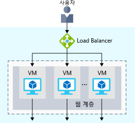
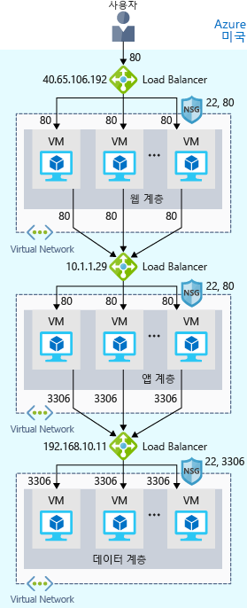
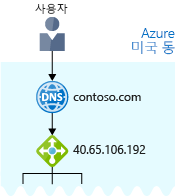

이제 Azure에서 가동되고 실행되는 사이트가 있습니다. 사이트가 연중 무휴로 실행되는지 확인하려면 어떻게 해야 할까요?

예를 들어 매주 유지 관리를 수행해야 하는 경우 어떻게 되나요? 유지 관리 기간 동안에는 서비스를 계속 사용할 수 없습니다. 그리고 사이트는 전 세계 사용자에게 연결되므로 유지 관리를 위해 시스템을 가동 중지할 시간이 없습니다. 또한 너무 많은 사용자가 동시에 연결하면 성능 문제가 발생할 수도 있습니다.

## 가용성 및 고가용성이란?

_가용성_은 서비스가 중단 없이 가동되어 실행되는 기간을 나타냅니다. _고가용성_ 또는 _가용성이 높음_은 오랜 기간 동안 가동되어 실행되는 서비스를 나타냅니다.

매일 방문하는 소셜 미디어 또는 뉴스 사이트를 생각해 보세요. 언제든지 사이트에 액세스할 수 있나요? 또는 "503 서비스를 사용할 수 없음"과 같은 오류 메시지가 자주 표시되나요? 필요한 정보에 액세스할 수 없을 때 얼마나 실망하는지 알고 있습니다.

들어보았을 것 "99.999 공급 합니다."와 같은 용어 99.999 가용성은 전체 시간의 99.999% 동안 서비스가 실행되도록 보장한다는 것을 의미합니다. 100% 가용성을 달성하기는 어렵지만, 많은 팀에서 99.999 이상의 가용성을 위해 노력합니다.

## 복원력이란?

_복원력_은 비정상적인 상태에서도 작동을 유지하는 시스템의 기능을 나타냅니다.

이러한 조건은 다음과 같습니다.

- 자연 재해
- 시스템 유지 관리 계획 되거나 계획 되지 않은 소프트웨어 업데이트와 보안 패치를 포함 합니다.
- 사이트 트래픽 급증 합니다.
- 서비스 또는 DDoS, 분산된 서비스 거부 공격 등 악의적인 사용자가 수행한 된 위협이 있습니다.

마케팅 팀에서 새로운 제품의 줄을 승격 하려면 플래시 판매를 제공 하고자 한다고 가정 합니다. 이 기간 동안 트래픽이 엄청나게 급증할 것으로 예상할 수 있습니다. 이 급증은 처리 시스템을 압도함으로써 시스템이 느려지거나 중지되어 사용자를 실망시킬 수 있습니다. 스스로 이러한 실망을 경험했을 것입니다. 표시할 웹 사이트 응답 되지 않은 이벤트에 대 한 티켓 싶었던 적이 있습니까?

## 부하 분산 장치란?

_부하 분산 장치_는 트래픽을 풀의 각 시스템 간에 균등하게 분산시킵니다. 부하 분산 장치는 고가용성 및 복원력 모두를 달성하는 데 도움을 줄 수 있습니다.

각 계층에 동일하게 구성된 추가 VM을 추가하여 시작한다고 가정해 보세요. 아이디어는 하나의 작동이 중단 되거나 동시에 너무 많은 사용자가 제공 되는 경우 준비가 되 면 추가 시스템을 것입니다.

여기서 문제는 각 VM에 자체의 IP 주소가 있다는 것입니다. 또한 한 시스템이 가동 중지되거나 사용량이 많은 경우에는 트래픽을 분산시킬 방법이 없습니다. 사용자에게 하나의 시스템으로 표시되도록 VM을 연결하려면 어떻게 할까요?

대답은 부하 분산 장치를 사용하여 트래픽을 분산시키는 것입니다. 부하 분산 장치는 사용자의 진입점이 됩니다. 사용자는 부하 분산 장치에서 요청을 받기 위해 선택한 시스템을 알지 못하거나 알고 있을 필요가 없습니다.

다음 그림에서는 부하 분산 장치 역할을 보여 줍니다.

사용자의 요청을 받는 부하 분산 장치가 표시됩니다. 부하 분산 장치는 웹 계층의 VM 중 하나에 해당 요청을 보냅니다. VM을 사용할 수 없거나 응답을 중지하면 부하 분산 장치에서 트래픽을 보내지 않습니다. 그런 다음, 부하 분산 장치는 트래픽을 응답성이 뛰어난 서버 중 하나로 보냅니다.

부하 분산을 통해 서비스를 중단하지 않고 유지 관리 작업을 실행할 수 있습니다. 예를 들어 각 VM에 대한 유지 관리 기간을 조정할 수 있습니다. 유지 관리 기간 동안 부하 분산 장치 VM은 응답 하지 않습니다 하 고 풀의 다른 Vm에 트래픽을 검색 합니다.

전자 상거래 사이트의 경우 앱 및 데이터 계층에 부하 분산 장치가 있을 수도 있습니다. 이러한 구성은 모두 서비스의 요구 사항에 따라 다릅니다.

## Azure Load Balancer란?

Azure Load Balancer는 Microsoft에서 제공하는 부하 분산 장치 서비스입니다.

가상 머신에서 부하 분산 장치 소프트웨어를 수동으로 구성할 수 있습니다. 단점은 유지 관리해야 하는 추가 시스템이 있다는 것입니다. 부하 분산 장치가 가동 중지되거나 일상적으로 유지 관리해야 하는 경우 원래 문제로 돌아갑니다.

대신, 인프라 또는 소프트웨어가 유지 관리가 없습니다 있기 때문에 Azure Load Balancer를 사용할 수 있습니다. Azure 유지 관리를 담당합니다.

다음 그림은 다중 계층 아키텍처에서 Azure load balancer의 역할을 보여 줍니다.

## DNS는 어떨까요?

DNS(Domain Name System)은 사용자에게 친숙한 이름을 해당 IP 주소에 매핑하는 방법입니다. DNS는 인터넷의 전화 번호부도 생각할 수 있습니다.

예를 들어 contoso.com 도메인 이름은 웹 계층의 부하 분산 장치 IP 주소인 40.65.106.192에 매핑할 수 있습니다.

사용자 고유의 DNS 서버를 가져오거나 Azure 인프라에서 실행되는 DNS 도메인에 대한 호스팅 서비스인 Azure DNS를 사용할 수 있습니다.

다음 그림에서는 Azure DNS를 보여 줍니다. 사용자가 contoso.com으로 이동하면 Azure DNS에서 트래픽을 부하 분산 장치로 라우팅합니다.

## 요약

이제 부하 분산을 통해 전자 상거래 사이트의 가용성과 복원력이 향상되었습니다. 유지 관리를 수행하거나 트래픽이 약간 증가할 때 부하 분산 장치에서 트래픽을 사용 가능한 다른 시스템에 분산시킬 수 있습니다.

VM에서 부하 분산 장치를 구성할 수 있습니다, 있지만 Azure Load Balancer 인프라 또는 소프트웨어가 유지 하기 위해 없습니다 이므로 진다는 점을 줄입니다.

DNS는 사용자에게 친숙한 이름을 해당 IP 주소에 매핑합니다. 이는 전화 번호부에서 사람이나 회사의 이름을 전화 번호에 매핑하는 것과 같습니다. 사용자 고유의 DNS 서버를 가져올 수도 있고 Azure DNS를 사용할 수 있습니다.
