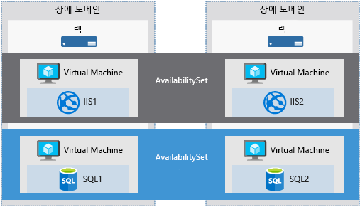

서비스 회사의 성공은 종종 회사와 고객이 체결한 SLA(서비스 수준 약정)와 직접 관련이 있습니다.Often, the success of a services company is directly related to the service level agreements (SLA) the company has with its customers. 고객은 제공되는 서비스를 항상 사용할 수 있고 데이터를 안전하게 유지할 수 있기를 기대합니다.Your customers expect the services you provide always to be available and their data kept safe. 이것은 Microsoft에서 매우 진지하게 생각하는 것입니다.This is something that Microsoft takes very seriously. Azure는 가용성, 데이터 보안 및 모니터링을 관리하는 데 사용할 수 있는 도구를 제공하므로 고객은 언제든지 서비스를 사용할 수 있습니다.Azure provides tools you can use to manage availability, data security, and monitoring, so you know your services are always available for your customers.

Azure VM 관리는 VM에서 실행되는 운영 체제 또는 소프트웨어 관리에만 국한되지 않습니다.Administration of an Azure VM isn't limited to managing the operating system or software that runs on the VM. Azure에서 서비스 가용성을 보장하고 자동화를 지원하기 위해 제공하는 서비스를 파악하는 데 도움이 됩니다.It helps to know which services Azure provides that ensure service availability and support automation. 이러한 서비스는 조직의 비즈니스 연속성 및 재해 복구 전략을 계획하는 데 도움이 됩니다.These services help you to plan your organization's business continuity and disaster recovery strategy.

여기서는 VM 가용성을 향상하고, VM 관리 작업을 간소화하고, VM 데이터를 백업하고 안전하게 유지하는 데 도움이 되는 Azure 서비스에 대해 설명합니다.Here, we'll cover an Azure service that helps you improve VM availability, streamlines VM management tasks, and keeps your VM data backed up and safe. 가용성을 정의하면서 시작해 보겠습니다.Let's start by defining availability.

## 가용성이란?What is availability?

가용성은 서비스를 사용할 수 있는 시간의 백분율입니다.Availability is the percentage of time a service is available for use.

웹 사이트가 있고 고객이 항상 정보에 액세스할 수 있기를 원한다고 가정해 보겠습니다.Let's assume you have a website and you want your customers to be able to access information at all times. 웹 사이트 액세스와 관련하여 100% 가용성을 기대할 것입니다.Your expectation is 100% availability concerning website access.

### Azure를 사용하는 경우 가용성을 고려해야 하나요?Why do I need to think about availability when using Azure?

Azure VM은 Azure 데이터 센터 내에서 호스트되는 물리적 서버에서 실행됩니다.Azure VMs run on physical servers hosted within the Azure Datacenter. 대부분의 물리적 장치와 마찬가지로 오류가 발생할 수 있습니다.As with most physical devices, there's a chance that there could be a failure. 물리적 서버가 실패하면 해당 서버에서 호스트되는 가상 머신도 실패합니다.If the physical server fails, the virtual machines hosted on that server will also fail. 이 경우 Azure는 VM을 정상 호스트 서버로 자동으로 이동시킵니다.If this happens, Azure will move the VM to a healthy host server automatically. 그러나 이 자동 복구 마이그레이션에는 몇 분이 걸릴 수 있으며, 그동안 해당 VM에서 호스트되는 응용 프로그램을 사용할 수 없습니다.However, this self-healing migration could take several minutes, during which, the application(s) hosted on that VM will not be available.

또한 VM은 Azure 자체에서 시작된 정기적인 업데이트로 인해 영향을 받을 수도 있습니다.The VMs could also be affected by periodic updates initiated by Azure itself. 이러한 유지 관리 이벤트는 소프트웨어 업데이트에서 하드웨어 업그레이드에 이르기까지 다양하며, 플랫폼 안정성 및 성능을 향상하는 데 필요합니다.These maintenance events range from software updates to hardware upgrades and are required to improve platform reliability and performance. 이러한 이벤트는 일반적으로 게스트 VM에 영향을 주지 않고 수행되지만, 업데이트 또는 업그레이드를 완료하기 위해 가상 머신이 다시 부팅되는 경우도 있습니다.These events usually are performed without impacting any guest VMs, but sometimes the virtual machines will be rebooted to complete an update or upgrade.

> [!NOTE]
> Microsoft는 VM OS 또는 소프트웨어를 자동으로 업데이트하지 않습니다.Microsoft does not automatically update your VM's OS or software. 이러한 작업은 전적으로 사용자의 제어와 책임하에 수행됩니다.You have complete control and responsibility for that. 그러나 기본 소프트웨어 호스트 및 하드웨어는 항상 안정성과 고성능을 보장하기 위해 정기적으로 패치됩니다.However, the underlying software host and hardware are periodically patched to ensure reliability and high performance at all times.

서비스가 중단되지 않고 단일 실패 지점을 방지하려면 각 VM의 인스턴스를 둘 이상 배포하는 것이 좋습니다.To ensure your services aren't interrupted and avoid a single point of failure, it's recommended to deploy at least two instances of each VM. 이 기능을 _가용성 집합_이라고 합니다.This feature is called an _availability set_.

### 가용성 집합이란?What is an availability set?

**가용성 집합**은 관련된 VM 그룹을 배포하여 데이터 센터에서 호스트 운영 체제를 업그레이드하는 동안 이러한 VM이 모두 단일 실패 지점의 영향을 받지 않고 동시에 업그레이드되지 않도록 하는 데 사용되는 논리적 기능입니다.An **availability set** is a logical feature used to ensure that a group of related VMs are deployed so that they aren't all subject to a single point of failure and not all upgraded at the same time during a host operating system upgrade in the datacenter. 가용성 집합에 배치된 VM은 일단의 동일한 기능을 수행하고 동일한 소프트웨어를 설치해야 합니다.VMs placed in an availability set should perform an identical set of functionalities and have the same software installed.

> [!TIP]
> Microsoft는 가용성 집합에 배포된 다중 인스턴스 VM에 대해 99.95% 외부 연결 SLA(서비스 수준 약정)를 제공합니다.Microsoft offers a 99.95% external connectivity service level agreement (SLA) for multiple-instance VMs deployed in an availability set. 즉 SLA를 적용하려면 가용성 집합 내에 VM의 인스턴스가 둘 이상 배포되어야 합니다.That means that for the SLA to apply, there must be at least two instances of the VM deployed within an availability set. 

재해 복구 섹션에서 Azure Portal을 통해 가용성 집합을 만들 수 있습니다.You can create availability sets through the Azure portal in the disaster recovery section. 또한 Resource Manager 템플릿이나 스크립팅 또는 API 도구를 사용하여 가용성 집합을 작성할 수 있습니다.Also, you can build them using Resource Manager templates, or any of the scripting or API tools. VM을 가용성 집합에 배치하는 경우 Azure는 **장애 도메인** 및 **업데이트 도메인**에 분산되도록 보장합니다.When you place VMs into an availability set, Azure guarantees to spread them across **Fault Domains** and **Update Domains**.

#### 장애 도메인이란?What is a fault domain?

장애 도메인은 공통 전원과 네트워크 스위치를 공유하는 Azure의 하드웨어 논리 그룹입니다.A fault domain is a logical group of hardware in Azure that shares a common power source and network switch. 온-프레미스 데이터 센터 내의 랙으로 간주할 수 있습니다.You can think of it as a rack within an on-premises datacenter. 가용성 집합의 처음 두 VM은 서로 다른 두 개의 랙에 프로비전되므로 랙에서 네트워크 또는 전원 오류가 발생하면 하나의 VM만 영향을 받습니다.The first two VMs in an availability set will be provisioned into two different racks so that if the network or the power failed in a rack, only one VM would be affected. 또한 장애 도메인은 VM에 연결된 관리 디스크에 대해서도 정의됩니다.Fault domains are also defined for managed disks attached to VMs.

#### 업데이트 도메인이란?What is an update domain?

업데이트 도메인은 유지 관리를 수행하거나 동시에 다시 부팅할 수 있는 하드웨어의 논리 그룹입니다.An update domain is a logical group of hardware that can undergo maintenance or be rebooted at the same time. Azure는 Azure 플랫폼에서 호스트 운영 체제 변경을 도입할 때 미치는 영향을 최소화하기 위해 가용성 집합을 업데이트 도메인에 자동으로 배치합니다.Azure will automatically place availability sets into update domains to minimize the impact when the Azure platform introduces host operating system changes. 그런 다음, Azure에서 각 업데이트 도메인을 한 번에 하나씩 처리합니다.Azure then processes each update domain one at a time.

가용성 집합은 고객이 VM에서 실행되는 서비스를 항상 사용할 수 있도록 하는 강력한 기능입니다.Availability sets are a powerful feature to ensure the services running in your VMs are always available to your customers. 그러나 누구나 사용할 수 있는 것은 아닙니다.However, they aren't foolproof. VM 자체에서 실행되는 데이터 또는 소프트웨어에 문제가 발생하면 어떻게 해야 하나요?What if something happens to the data or the software running on the VM itself? 이 경우 다른 재해 복구 및 백업 기술을 살펴볼 필요가 있습니다.For that, we'll need to look at other disaster recovery and backup techniques.

## 위치 간 장애 조치(failover)Failover across locations

사이트 간에 인프라를 복제하여 지역별 장애 조치(failover)를 처리할 수도 있습니다.You can also replicate your infrastructure across sites to handle regional failover. **Azure Site Recovery**는 워크로드를 주 사이트에서 보조 위치로 복제합니다.**Azure Site Recovery**  replicates workloads from a primary site to a secondary location. 주 사이트에서 중단이 발생하면 보조 위치로 장애 조치할 수 있습니다.If an outage happens at your primary site, you can fail over to a secondary location. 이 장애 조치를 통해 사용자는 중단 없이 응용 프로그램에 계속 액세스할 수 있습니다.This failover allows users to continue to access your applications without interruption. 그런 다음, 응용 프로그램이 다시 실행되면 기본 위치로 장애 복구될 수 있습니다.You can then fail back to the primary location once it's up and running again. Azure Site Recovery는 가상 머신 또는 물리적 머신의 복제에 관한 것으로, 가동 중단 중에도 워크로드를 사용할 수 있도록 합니다.Azure Site Recovery is about replication of virtual or physical machines; it keeps your workloads available in an outage.

Site Recovery에는 매력적인 많은 기술적 기능이 있지만 적어도 두 가지 중요한 비즈니스 이점이 있습니다.While there are many attractive technical features to Site Recovery, there are at least two significant business advantages:

1. Site Recovery를 사용하면 Azure를 복구 대상으로 사용할 수 있으므로 보조 물리적 데이터 센터의 유지 관리에 따른 비용과 복잡성을 없앨 수 있습니다.Site Recovery enables the use of Azure as a destination for recovery, thus eliminating the cost and complexity of maintaining a secondary physical datacenter.

2. Site Recovery를 사용하면 프로덕션 환경에 영향을 주지 않고 복구 훈련을 위한 장애 조치(failover)를 매우 간단하게 테스트할 수 있습니다.Site Recovery makes it incredibly simple to test failovers for recovery drills without impacting production environments. 이렇게 하면 계획되었거나 계획되지 않은 장애 조치를 쉽게 테스트할 수 있습니다.This makes it easy to test your planned or unplanned failovers. 요컨대 장애 조치(failover)를 시도한 적이 없으면 적절한 재해 복구 계획이 없는 것입니다.After all, you don’t have a good disaster recovery plan if you’ve never tried to failover.

Site Recovery를 사용하여 만든 복구 계획은 시나리오에 필요한 만큼 간단하거나 복잡할 수 있습니다.The recovery plans you create with Site Recovery can be as simple or as complex as your scenario requires. 여기에는 사용자 지정 PowerShell 스크립트, Azure Automation Runbook 또는 수동 개입 단계가 포함될 수 있습니다.They can include custom PowerShell scripts, Azure Automation runbooks, or manual intervention steps. 복구 계획을 활용하여 워크로드를 Azure로 복제하여 마이그레이션, 서지 기간의 임시 버스트 또는 새 응용 프로그램 개발 및 테스트에 대한 새로운 기회를 손쉽게 수행할 수 있습니다.You can leverage the recovery plans to replicate workloads to Azure, easily enabling new opportunities for migration, temporary bursts during surge periods, or development and testing of new applications.

Azure Site Recovery는 온-프레미스 인프라에서 Azure 리소스 또는 Hyper-V, VMware 및 실제 서버와 함께 작동하며, 기본 위치가 실패하는 경우 워크로드 및 응용 프로그램의 복제, 장애 조치(failover) 및 복구를 오케스트레이션함으로써 조직의 BCDR(비즈니스 연속성 및 재해 복구) 전략의 핵심 요소가 될 수 있습니다.Azure Site Recovery works with Azure resources, or Hyper-V, VMware, and physical servers in your on-premises infrastructure and can be a key part of your organization’s business continuity and disaster recovery (BCDR) strategy by orchestrating the replication, failover, and recovery of workloads and applications if the primary location fails.
