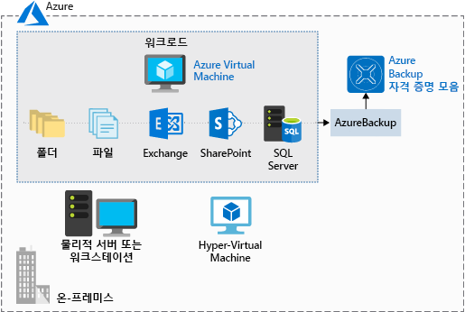

데이터 백업 및 복구는 적절한 인프라를 계획하는 데 필요한 부분입니다. 아마도 일부 데이터를 지우는 버그일 수도 있고 감사 목적으로 보관된 일부 데이터를 검색해야 할 수도 있습니다. 적절한 백업 전략을 유지하면 데이터 또는 소프트웨어를 복원해야 할 때 혼란에 빠지지 않을 수 있습니다.

**Azure Backup**은 온-프레미스 또는 클라우드 중 어느 위치에 있든 실제 또는 가상 머신을 보호하는 _서비스 기반 백업_ 제품입니다.

Azure Backup을 사용할 수 있는 다양한 데이터 백업 시나리오는 다음과 같습니다.

- Windows OS 머신(실제 또는 가상, 로컬 또는 클라우드)의 파일 및 폴더
- 응용 프로그램 인식 스냅숏(볼륨 섀도 복사본 서비스)
- 인기 있는 Microsoft 서버 워크로드(예: Microsoft SQL Server, Microsoft SharePoint 및 Microsoft Exchange)
- Azure Virtual Machines에 대한 기본 지원(Windows 및 Linux 모두)
- Linux 및 Windows 10 클라이언트 머신

## Azure Backup 사용의 장점

기존의 백업 솔루션은 기본 Azure 플랫폼을 최대한 활용하지는 않습니다. 결과적으로 비용이 많이 들거나 비효율적인 솔루션입니다. 솔루션에서 저장소를 너무 많이 또는 너무 적게 제공하거나, 올바른 유형의 저장소를 제공하지 않거나, 관리 작업이 번거롭고 오래 걸립니다. Azure Backup은 다른 Azure 서비스와 함께 작동하도록 설계되었으며, 몇 가지 차별화된 이점을 제공합니다.

- **자동 저장소 관리**. Azure Backup은 백업 저장소를 자동으로 할당하고 관리하며, 사용한 만큼 지불(pay-as-you-use) 모델을 사용합니다. 사용한 양만큼만 요금을 지불합니다.

- **무제한 크기 조정**. Azure Backup은 Azure의 성능과 확장성을 사용하여 고가용성을 제공합니다.

- **여러 저장소 옵션**. Azure Backup은 데이터의 모든 복사본이 동일한 지역 내에 있는 로컬 중복 저장소 및 데이터가 보조 지역으로 복제되는 지역 중복 저장소를 제공합니다.

- **무제한 데이터 전송**. Azure Backup은 인바운드 또는 아웃바운드 데이터를 무제한으로 전송할 수 있습니다. 또한 전송되는 데이터에 대해 요금을 청구하지 않습니다.

- **데이터 암호화**. 데이터 암호화를 사용하면 Azure에서 데이터를 안전하게 전송하고 저장할 수 있습니다.

- **응용 프로그램 일치 백업**. 복구 지점에 백업 복사본을 복원하는 데 필요한 모든 데이터가 있음을 의미합니다. Azure Backup은 응용 프로그램 일치 백업을 제공합니다.

- **장기 보존**. Azure는 백업 데이터를 유지하는 시간을 제한하지 않습니다.

## Azure Backup 사용

Azure Backup은 백업하려는 각 컴퓨터에 다운로드하여 배포하는 여러 구성 요소를 활용합니다. 배포하는 구성 요소는 보호하려는 대상에 따라 달라집니다.

- Azure Backup 에이전트
- System Center Data Protection Manager
- Azure Backup 서버
- Azure Backup VM 확장

Azure Backup은 Recovery Services 자격 증명 모음을 사용하여 백업 데이터를 저장합니다. 자격 증명 모음은 Azure Storage Blob을 통해 지원되므로 매우 효율적이고 경제적인 장기 저장 매체입니다. 적절한 자격 증명 모음을 사용하면 백업할 머신을 선택하고 백업 정책(스냅숏을 수행하는 경우 및 저장 기간)을 정의할 수 있습니다.