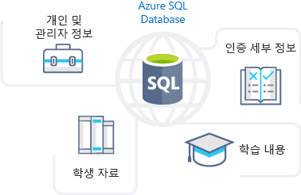
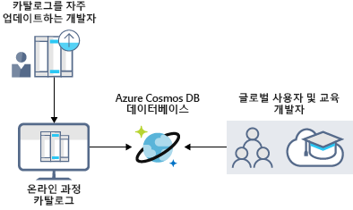
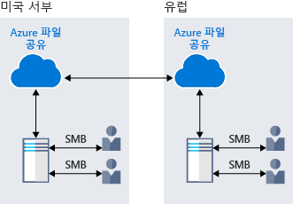
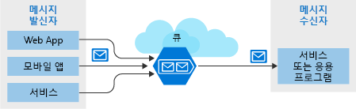
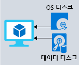

Azure Storage의 이점을 살펴보고 학습 포털을 저장하는 데 가장 적합한 옵션을 제공한다는 것을 이해합니다. 이제 Azure Storage에서 제공하는 이점과 옵션을 자세히 살펴보고 비즈니스 요구 사항을 충족하는 방법을 알아보겠습니다.

## Azure Storage가 비즈니스 저장소 요구 사항을 충족하는 방법

Azure Storage는 특정 유형의 데이터 저장소 요구 사항을 충족하는 몇 가지 옵션을 제공합니다.

### Azure SQL Database

**Azure SQL Database**는 모든 데이터를 저장하며 견고하고 완벽하게 관리되는 관계형 클라우드 데이터베이스입니다. 이 기능을 사용하여 직원의 개인 및 교육 관련 정보처럼 자주 액세스하고 업데이트하는 데이터를 저장할 수 있습니다. 응용 프로그램을 변경하지 않고 기존 SQL Server 데이터베이스를 마이그레이션할 수도 있습니다. 다음 일러스트레이션에서는 Azure SQL Database에 저장되어 있는 온라인 학습 포털 시나리오의 데이터 형식을 보여줍니다.

### Azure Cosmos DB

Azure Cosmos DB는 전역 분산 데이터베이스 서비스입니다. 지속적으로 변경되는 데이터를 지원하기 위해 응답성이 뛰어난 *Always On* 응용 프로그램을 구축할 수 있는 스키마 없는 데이터를 지원합니다. 이 기능을 사용하여 전세계 사용자의 입력을 기반으로 업데이트되고 유지 관리되는 데이터를 저장할 수 있습니다. 다음 일러스트레이션에서는 전세계 여러 사용자가 액세스하는 데이터를 저장하는데 사용되는 샘플 Azure Cosmos DB 데이터베이스를 보여줍니다.

### Azure Blob Storage

Azure Blob Storage는 전 세계 어디에서나 대용량 비디오 또는 오디오 파일을 사용자 브라우저로 직접 스트리밍하는 기능을 제공합니다. Blob Storage를 사용하여 백업/복원, 재해 복구 및 보관용 데이터를 저장하기도 합니다. Azure Blob Storage는 가상 머신용 파일을 저장하는데 최대 8TB의 데이터를 사용할 수 있습니다. 다음 일러스트레이션에서는 Azure Blob Storage의 예제 사용법을 보여줍니다.

### Azure Data Lake Storage Gen2

Azure Storage의 Data Lake 기능을 사용하면 데이터 사용량을 분석하고 분석 결과에 따라 보고서를 준비할 수 있습니다. Data Lake는 구조적 데이터와 비구조적 데이터가 모두 저장되는 대형 리포지토리입니다.

**Azure Data Lake Storage Gen2**에서는 개체 저장소의 확장성 및 비용 혜택을 빅 데이터 파일 시스템 기능의 안정성 및 성능과 결합합니다. 다음 일러스트레이션에서는 Azure Data Lake에서 모든 비즈니스 데이터를 저장하고 분석에 사용하는 방법을 보여줍니다.

### Azure Files

Azure Files는 클라우드에서 완벽하게 관리되는 파일 공유를 제공합니다. Azure에서 실행되는 응용 프로그램은 VM 간에 쉽게 파일을 공유할 수 있습니다. Azure 파일 공유를 Windows, Linux 및 macOS의 클라우드 또는 온-프레미스 배포에 동시에 사용할 수 있습니다. 다음 일러스트레이션에서는 두 지역 간에 데이터를 공유하는데 사용되는 Azure Files를 보여줍니다. Azure Files는 미사용 및 전송 중 데이터가 암호화되었는지 확인하는 SMB(서버 메시지 블록) 프로토콜을 사용합니다.

### Azure Queue

Azure Queue Storage는 전 세계 어디에서나 액세스할 수 있는 많은 수의 메시지를 저장하기 위한 서비스입니다. 단일 큐 메시지의 크기는 최대 64KB이며 큐에는 수백만 개의 메시지가 포함될 수 있습니다.

일반적으로 하나 이상의 송신기 구성 요소와 하나 이상의 수신기 구성 요소가 있습니다. 송신기 구성 요소는 큐에 메시지를 추가합니다. 수신기 구성 요소는 큐의 앞에서 처리할 메시지를 검색합니다. 다음 그림은 Azure 큐에 메시지를 추가하는 여러 송신기 응용 프로그램과 메시지를 검색하는 하나의 수신기 응용 프로그램을 보여 줍니다.

Queue Storage는 주로 다음과 같은 용도로 사용됩니다.

- 작업의 백로그를 만들고 서로 다른 Azure 웹 서버 간에 메시지를 전달하기 위해 사용됩니다.
- 서로 다른 웹 서버/인프라 간에 부하를 분산하고 트래픽 버스트를 관리하기 위해 사용됩니다.
- 여러 사용자가 동시에 데이터에 액세스할 때 구성 요소 오류에 대한 복원력을 빌드하기 위해 사용됩니다.

### Azure Standard Storage

Azure의 가상 머신은 디스크를 사용하여 운영 체제, 응용 프로그램 및 데이터를 저장합니다. Azure Standard Storage는 중요 업무용이 아닌 워크로드를 실행하는 VM에 대해 안정적인 저비용 디스크 지원을 제공합니다. Standard Storage를 사용하면 데이터가 HDD(하드 디스크 드라이브)에 저장됩니다.

VM 작업 시 덜 중요한 워크로드에는 표준 SSD 및 HDD 디스크를 사용하고 중요 업무용 프로덕션 응용 프로그램에는 프리미엄 SSD 디스크를 사용할 수 있습니다. Azure 디스크는 업계 최고의 0% 연간 실패율(Annualized Failure Rate)로 엔터프라이즈급 내구성을 일관되게 제공합니다. 다음 일러스트레이션에서는 다른 데이터를 저장하기 위해 별도 디스크를 사용하는 Azure 가상 머신을 보여줍니다.

### 저장소 계층

Azure Storage는 Blob 개체 저장소에 다음 세 가지 저장소 계층을 제공합니다.

1. **핫 저장소 계층** - Azure 핫 저장소 계층은 자주 액세스하는 데이터 저장에 최적화되어 있습니다. 

1. **쿨 저장소 계층** - Azure 쿨 저장소 계층은 드물게 액세스하며 최소 30일 동안 저장되는 데이터 저장에 최적화되어 있습니다.

1. **보관 저장소 계층** - Azure 보관 저장소 계층은 거의 액세스하지 않고 유연한 대기 시간을 요구하며 최소 180일 동안 저장되는 데이터 저장에 최적화되어 있습니다. Azure의 보관 저장소는 이전 버전의 데이터를 저장하는데 적합하므로 감사나 다른 자주 사용하지 않는 작업에 필요할 때 보관 저장소를 검색할 수 있습니다.

다음 일러스트레이션에서는 Azure Blob Storage 계층을 보여줍니다.

### Azure Storage 암호화/복제

Azure Storage는 암호화 및 복제 기능을 통해 보안 및 고가용성을 데이터에 제공합니다.

#### 저장소 서비스에 대한 암호화

리소스에 사용할 수 있는 암호화 유형은 다음과 같습니다.

1. 미사용 데이터에 대한 **Azure SSE(저장소 서비스 암호화)** 를 사용하면 조직의 보안 및 규정 준수를 충족하도록 데이터를 보호할 수 있습니다. Azure SSE는 데이터를 저장하기 전에 암호화하고 데이터를 검색하기 전에 암호를 해독합니다. 암호화 및 암호 해독은 사용자에게 투명하게 이루어집니다.
1. **클라이언트 쪽 암호화**에서는 클라이언트 라이브러리에 의해 데이터가 이미 암호화되어 있습니다. Azure는 암호화된 상태로 미사용 데이터를 저장합니다. 그런 다음, 검색 중에 암호를 해독합니다.

    이 암호화 기능을 사용하면 데이터가 글로벌 보호 표준을 충족하도록 할 수 있습니다. 개인 및 재무 데이터 같은 민감한 정보를 저장하는 데 적합합니다.

#### 저장소 가용성 복제

복제 유형은 저장소 계정을 만들 때 설정됩니다. 복제 기능을 사용하면 데이터의 지속성과 고가용성을 확보할 수 있습니다. Azure Storage를 사용하면 지역 및 지리적 복제를 통해 화재나 홍수 같은 자연재해 및 기타 지역 재해로부터 데이터를 보호할 수 있습니다.
