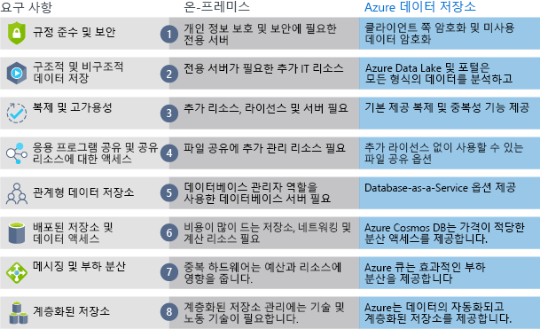

Azure 데이터 저장소의 혜택과 기능에 대해 알게 되었으므로 이제 Azure 데이터 저장소가 온-프레미스 저장소와 어떻게 다른지 살펴보겠습니다.Now that you know about the benefits and features of Azure data storage, let's see how it differs from on-premises storage.

“온-프레미스”라는 용어는 로컬 하드웨어 및 서버에 데이터를 저장하고 유지 관리하는 것을 의미합니다.The term "on-premises" refers to the storage and maintenance of data on local hardware and servers. 온-프레미스와 Azure 데이터 저장소를 비교할 때 고려해야 할 여러 요인이 있습니다.There are several factors to consider when comparing on-premises to Azure data storage.

:::row:::
  :::column:::
    
  :::column-end:::
    :::column span="3"::: **비용 효과**:::column span="3"::: **Cost effectiveness**

온-프레미스 저장소 솔루션은 구매하고, 설치하고, 구성하고, 유지 관리해야 하는 전용 하드웨어가 필요합니다.An on-premises storage solution requires dedicated hardware that needs to be purchased, installed, configured, and maintained. 이것은 상당한 선행 비용(또는 자본 비용)이 될 수 있습니다.This can be a significant up-front expense (or capital cost). 요구 사항의 변화는 새 하드웨어에 대한 투자가 필요할 수 있습니다.Change in requirements can require investment in new hardware. 하드웨어가 최대 수요를 처리할 수 있어야 합니다. 즉, 사용량이 적은 시간에는 가동되지 않거나 활용되지 않을 수 있습니다.Your hardware needs to be capable of handling peak demand which means it may sit idle or be under-utilized in off-peak times.

Azure 데이터 저장소에는 선행 자본 비용이 아닌 운영 비용으로 비즈니스에 유용한 경우가 많은 종량제 가격 책정 모델이 적용됩니다.Azure data storage provides a pay-as-you-go pricing model which is often appealing to businesses as an operating expense instead of an upfront capital cost. 확장성이 뛰어나기 때문에 요구 사항에 따라 확장하거나 스케일 아웃했다가 수요가 줄어들면 다시 축소할 수 있습니다.It's also scalable, allowing you to scale up or scale out as demand dictates and scale back when demand is low. 필요할 때만 데이터 서비스에 대해 요금이 청구됩니다.You are charged for data services only as you need them.

:::column-end:::
:::row-end:::
:::row:::
  :::column:::
    
  :::column-end:::
    :::column span="3"::: **신뢰성**:::column span="3"::: **Reliability**

온-프레미스 저장소에는 데이터 백업, 부하 분산 및 재해 복구 전략이 필요합니다.On-premises storage requires data backup, load balancing, and disaster recovery strategies. 여기에는 하드웨어 및 IT 리소스 모두에 막대한 투자가 요구되는 전용 서버가 필요하기 때문에 어렵고 비용이 많이 듭니다.These can be challenging and expensive as they often each need dedicated servers requiring a significant investment in both hardware and IT resources.

Azure 데이터 저장소는 데이터 백업, 부하 분산, 재해 복구 및 데이터 복제를 서비스 형태로 제공하기 때문에 데이터 안전성과 높은 가용성을 보장합니다.Azure data storage provides data backup, load balancing, disaster recovery, and data replication as services to ensure data safety and high availability.

:::column-end:::
:::row-end:::
:::row:::
  :::column:::
    
  :::column-end:::
    :::column span="3"::: **저장소 유형**:::column span="3"::: **Storage types**

파일 및 데이터베이스 저장소와 같은 솔루션에 여러 가지 저장소 유형이 필요한 경우가 있습니다.Sometimes multiple different storage types are required for a solution, such as file and database storage. 온-프레미스 방식에는 저장소 유형마다 다수의 서버와 관리 도구가 필요한 경우가 많습니다.An on-premises approach often requires numerous servers and administrative tools for each storage type.

Azure 데이터 저장소에는 분산 액세스 및 계층형 저장소를 비롯한 다양한 저장소 옵션이 제공됩니다.Azure data storage provides a variety of different storage options including distributed access and tiered storage. 따라서 솔루션의 각 부분에 대해 최상의 저장소 옵션을 제공하는 저장소 기술의 조합을 통합할 수 있습니다.This makes it possible to integrate a combination of storage technologies providing the best storage choice for each part of your solution.

:::column-end:::
:::row-end:::
:::row:::
  :::column:::
    
  :::column-end:::
    :::column span="3"::: **민첩성**:::column span="3"::: **Agility**

요구 사항 및 기술은 변화합니다.Requirements and technologies change. 온-프레미스 배포의 경우, 이런 상황이 발생하면 새로운 서버와 인프라를 프로비전하고 배포해야 하므로 시간과 비용이 많이 듭니다.For an on-premises deployment this may mean provisioning and deploying new servers and infrastructure pieces, which is a time consuming and expensive activity.

Azure 데이터 저장소는 몇 분 안에 새로운 서비스를 만들 수 있는 유연성을 제공합니다.Azure data storage gives you the flexibility to create new services in minutes. 이 유연성을 사용하면 하드웨어에 상당한 투자를 하지 않고도 저장소 백 엔드를 신속하게 변경할 수 있습니다.This flexibility allows you to change storage back-ends quickly without needing a significant hardware investment.

다음 일러스트레이션에서는 온-프레미스 저장소와 Azure 데이터 저장소 간의 차이점을 보여줍니다.The following illustration shows differences between on-premise storage and Azure data storage.

  :::column-end:::
:::row-end:::