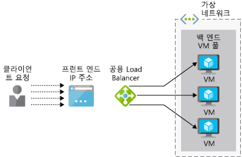
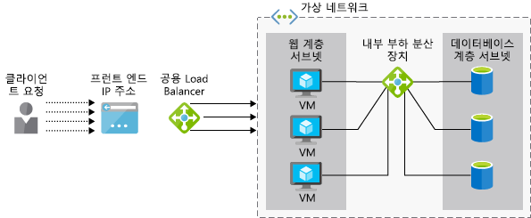

회사에서 Azure Load Balancer는 엔터프라이즈 리소스 계획 (ERP) 응용 프로그램을 지 원하는 경우 확인 하려는 경우 응용 프로그램에 사용자를 위한 웹 인터페이스 및 여러 서버에서 실행 합니다. 각 서버에는 모든 서버에서 동기화 되는 ERP 데이터베이스의 로컬 복사본을 있습니다.

여기에서 어떻게 부하 분산 장치를 서비스의 고가용성을 제공할 수 있습니다 보면 됩니다. 기본 및 표준 부하 분산 장치 옵션 간의 차이점을 식별 되며 Azure Virtual Machines에 대 한 부하 분산 장치를 만드는 방법을 보여 줍니다.

## 부하 분산은 무엇입니까?

_부하 분산_ 계산, 저장소, 등의 여러 장치 간에 워크 로드를 배포 하 고 네트워킹 장치에 대 한 다양 한 기술을 설명 합니다. 인프라를 확장 하 고 되도록 일부 구성 요소를 사용할 수 없는 경우 서비스 유지 됩니다 이러한 리소스를 가장 효율적으로 사용할 수 있도록 여러 리소스의 사용을 최적화 하려면 부하 분산의 목표가입니다.

여기에서 Azure의 부하 분산 Vm (가상 머신)에 대 한 지원이 살펴보겠습니다.

### 고가용성이란?

고가용성 (HA)에 계속 액세스할 수 있더라도 모든 시스템 구성 요소에서 오류가 응용 프로그램 또는 서비스의 능력을 측정 합니다. 이상적으로 수 더 이상 없습니다 서비스의 눈에 띄는 손실 합니다.

부하 분산은 여러 Vm 역할에서 서버 풀을 허용 하므로 HA 배달 하려면입니다. 풀 계속 서비스 요청 하더라도 일부 Vm 충돌 하거나 유지 관리에 대 한 오프 라인 상태가 됩니다.

## Azure Load Balancer란?

**Azure Load Balancer** 는 풀의 여러 Vm에서 들어오는 요청을 배포 하는 Azure 서비스입니다. 정상 Vm 집합을 사용 하 여 들어오는 네트워크 트래픽을 분산 하 고 응답할 수 없는 모든 VM을 방지 합니다.

 Azure Load Balancer는 계층 4 (TCP, UDP) OSI 계층 7 모델에서 작동합니다. 지원 TCP 및 UDP 응용 프로그램 시나리오 트래픽이 Azure Vm에 바인딩되어 있지 않은 뿐만 아니라 아웃 바운드 시나리오는 다른 Azure 서비스에 전달 하는 TCP 및 UDP 트래픽을 Azure Vm을 통해 외부 끝점을 구성할 수 있습니다.

> [!VIDEO https://www.microsoft.com/videoplayer/embed/RE2yBWo]

## 공용 및 내부 부하 분산 장치

Azure Load Balancer를 수 있습니다 _공개_ 하거나 _내부_ 들어오는 요청의 원본에 따라 합니다.

A **공용 부하 분산 장치** Azure 인프라 외부에서 클라이언트 요청을 처리 합니다. 부하 분산 장치의 공용 IP 주소는 공용 IP 및 부하 분산 장치 리소스를 만들 때 자동으로 부하 분산 장치의 프런트 엔드로 구성 됩니다. 다음 그림에는 공용 부하 분산 장치를 보여 줍니다.

**내부 부하 분산 장치** 가상 네트워크 내에서 (또는 VPN을 통해)에서 요청을 처리 합니다. 해당 가상 네트워크 내의 리소스에 대 한 요청을 배포합니다. Load balancer, 프런트 엔드 IP 주소 및 가상 네트워크는 인터넷에서 직접 액세스할 수 없는 합니다. 다음 그림에서는 두 공용 및 내부 부하 분산 장치를 포함 하는 아키텍처를 보여 줍니다. 공용 부하 분산 장치는 내부 부하 분산 장치를 내부 Vm 및 처리를 위해 데이터베이스에 요청을 전달 하는 동안 외부 요청을 처리 합니다.

## Azure Load Balancer는 어떻게 작동 하나요?

구성 정보를 사용 하는 azure Load Balancer **규칙** 및 **상태 프로브** 부하 분산 장치에 수신 되는 새로운 인바운드 트래픽을 결정할 **프런트 엔드** 는 VM 인스턴스에 배포 된 **백 엔드 풀**합니다.

### 프런트 엔드

부하 분산 장치 프런트 엔드 IP 구성, 하나 이상의 공용 IP 주소를 포함 하는 인터넷을 통해 부하 분산 장치 및 해당 응용 프로그램에 액세스할 수 있는 경우

### 백 엔드 주소 풀

가상 컴퓨터는 해당 가상 네트워크 인터페이스 카드 (vNIC)를 사용 하 여 부하 분산 장치에 연결 합니다. 백 엔드 주소 풀의 부하 분산 장치에 연결 된 Vnic IP 주소를 포함 합니다. 가용성 집합의 모든 Vm을 배치 하는 경우 부하 분산 장치를 구성 하는 경우 백 엔드 풀에 Vm을 쉽게 추가 하는 데 사용할 수 있습니다.

### 상태 프로브

부하 분산 장치 사용 _상태 프로브_ 가상 머신을 요청을 처리할 수를 확인 하려면. 부하 분산 장치는 사용 가능 하 고 운영 하는 Vm에 트래픽을 분산만 합니다. 

상태 프로브가 각 VM에서 특정 포트를 모니터링합니다. "상태";에 해당 하는 응답 유형을 정의할 수 있습니다. 예를 들어 필요할 수 있습니다는 `HTTP 200 Available` 웹 응용 프로그램에서 응답 합니다. 기본적으로 VM은 수 표시 "" 15 초 간격으로 두 차례의 연속 실패 후.

### 부하 분산 장치 규칙

부하 분산 장치 _규칙_ 백 엔드 Vm에 트래픽을 분산 하는 방법을 정의 합니다. 목표 백 엔드 풀의 정상 Vm 간에 매우 요청을 분산 하는 것입니다.

Azure Load Balancer 인바운드 패킷 헤더를 다시 작성 하는 해시 기반 알고리즘을 사용 합니다. 기본적으로 부하 분산 장치에서 해시를 만듭니다.

- 원본 IP 주소
- 원본 포트
- 대상 IP 주소
- 대상 포트
- IP 프로토콜 번호

이 메커니즘 패킷 클라이언트 흐름 내에서 모든 패킷이 같은 백 엔드 VM 인스턴스에 전송 되는지 확인 합니다. 클라이언트에서 새 흐름을 사용 하 여 다른 원본 포트를 임의로 할당. 부하 분산 장치 및 해시를 변경 하는이 것이이 흐름 다른 백 엔드 끝점으로 보낼 수 있습니다.

## 기본 및 표준 Load Balancer Sku

두 가지 버전의 Azure Load Balancer: **기본적인** 하 고 **표준**합니다. 크기 조정, 기능 및 가격 측면에서 다릅니다. 예: 

- 표준 HTTPS를 지원 하지만 기본 않습니다.
- 표준에 훨씬 클 수 있는 풀 크기
- Basic 무료에는 표준 규칙 및 처리량에 따라 요금이 청구 됩니다.

표준은 Basic의 경우 적합 한 모든 시나리오의 상위 집합입니다 Basic 표준 에서도 작동 해야 합니다. 기본 SKU 프로덕션에 대 한 표준 하는 것이 일반적으로 프로토타입 및 테스트를 위한 것입니다.

## 기본 공용 load balancer의 배포를 시작 합니다.

VM 부하 분산 된 시스템을 만들려면 있습니다 필요한 자체 부하 분산 장치 가상 컴퓨터를 포함 하도록 가상 네트워크 만들기를 만들고 가상 네트워크에 Vm을 추가 합니다.

Azure portal을 사용 하 여 부하 분산 장치를 만들려면 다음을 정의 합니다.

- 부하 분산 장치 이름
- 유형: 공용 또는 내부
- SKU: Basic 또는 Standard
- 공용 IP 주소: 동적 또는 정적
- 리소스 그룹 및 위치

백 엔드 Vm에는 모든 연결 동일한 가상 네트워크에 다음이 리소스를 구성 해야 하므로:

- 가상 네트워크 이름
- 주소 공간 172.20.0.0/16 등을 사용 하려면
- 리소스 그룹
- 사용 하 여 서브넷의 이름
- 서브넷 (기본 공간 내의 이어야 함), 172.20.0.0/24 같은 주소 공간

그런 다음 백 엔드 Vm을 배포 만들고 가상 네트워크를 사용 하도록 구성 해야 합니다. 또한 동일한 가용성 집합에 Vm 배치 해야 합니다. 가용성 집합의 Vm 그룹에 걸쳐 한 내결함성 수준을 정의 되지만 부하 분산에 대 한 것도 백 엔드 풀에 Vm을 할당할 수 있습니다.

고가용성 솔루션의 일부로 Azure Load Balancer를 사용 하는 방법을 살펴 보았습니다. 다음으로, 고유한 부하 분산 장치를 배포 하려면 다음이 단계를 사용 합니다.