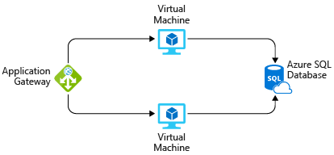

Azure에 시스템을 빌드하고 앞으로 12개월 동안 이 시스템을 실행하는 데 드는 비용을 예상하는 요청을 받았다고 가정해 보겠습니다. Azure 가격 책정은 완전히 투명하게 이루어지며 사용하는 서비스에 대해서만 월별로 요금이 청구된다는 점은 이미 알고 있습니다. 해당 서비스를 배포하여 실행하지 않고 또는 Azure 서비스 가격 페이지에서 수동으로 각 서비스 가격을 계산하지 않고 예상 비용을 알아보는 방법은 무엇인가요?

## Azure 가격 계산기 소개

고객이 쉽게 비용을 예상할 수 있도록 Microsoft는 **Azure 가격 계산기**를 개발했습니다. Azure 가격 계산기는 Azure 서비스를 입력하고 서비스 속성 및 옵션을 수정할 수 있는 무료 웹 기반 도구입니다. 이 도구는 서비스당 비용과 전체 예상 비용에 해당하는 비용 합계를 산출합니다.

다른 브라우저 창이나 탭에서 [Azure 가격 계산기](https://azure.microsoft.com/pricing/calculator/)로 이동합니다. 가격 계산기 페이지에는 다음 세 개의 탭이 표시됩니다.

1. **제품.** 이 탭에서 대부분의 활동을 수행합니다. 이 탭에는 모든 Azure 서비스가 나열되어 있으며 여기에서 예상 비용을 산출할 서비스를 추가하거나 제거합니다.
2. **예상 비용.** 이 탭에는 이전에 저장한 예상 비용이 모두 있습니다. 이 프로세스는 곧 수행해 볼 것입니다.
3. **FAQ.** 말 그대로, 이 탭에는 자주 묻는 일부 질문에 대한 답변이 있습니다.

**제품** 탭에서 시작하겠습니다. 왼쪽 아래에 전체 서비스 범주 목록이 표시됩니다. 범주를 클릭하면 해당 범주의 서비스가 표시됩니다. 모든 서비스 중에서 찾고 있는 서비스를 검색할 수 있는 검색 상자도 있습니다. 서비스를 클릭하면 해당 서비스가 예상 비용에 추가됩니다. 서비스를 하나만 추가할 수도 있고 가상 머신이 여러 개인 경우와 같이 동일한 서비스를 여러 번 추가하는 것을 비롯하여 필요한 만큼 많이 서비스를 추가할 수도 있습니다.

서비스를 추가한 후에는 가격을 계산할 것입니다. 페이지에서 아래로 스크롤하면 가격에 적용되는 서비스에 대한 사용자 지정할 수 있는 세부 정보가 표시됩니다. 예를 들어 가상 머신에 대해 지역, 운영 체제, 인스턴스 크기 같은 세부 정보를 선택할 수 있습니다. 이러한 정보는 모두 VM 가격에 영향을 줍니다. 서비스의 소계가 표시됩니다. 더 아래로 스크롤하면 예상 비용에 포함되는 모든 서비스에 대한 전체 합계가 표시됩니다. 합계와 함께 예상 비용을 내보내고, 저장하고, 공유할 수 있는 단추가 표시됩니다.

## 솔루션 비용 예상

원래 시나리오에서 이 시스템이 두 개의 Azure VM에서 실행되며 Azure SQL Database 인스턴스에 연결된다고 가정해 보겠습니다. 또한 부하 분산 기능이 향상 되었습니다 되도록 하기 위해 계층 7 방화벽에 하려고 합니다. 다음 그림은 단일 Azure SQL Database 인스턴스에 연결된 두 개의 가상 머신에 연결된 응용 프로그램 게이트웨이를 보여 줍니다.

Azure 가격 계산기를 사용하여 솔루션 비용이 얼마인지 파악하고 예상 비용을 내보내어 팀과 공유할 수 있습니다.

> [!TIP]
> 비용 예상에는 아무 항목도 표시되지 않은 깨끗한 계산기가 있어야 합니다. 비용 예상에 표시된 항목이 있는 경우 각 항목에서 휴지통 아이콘을 클릭하여 비용 예상을 다시 설정하세요.

Azure 가격 계산기의 **제품** 탭에서 다음 서비스를 클릭하여 예상에 추가합니다.

* 계산 범주의 Virtual Machines
* 데이터베이스 범주의 Azure SQL Database
* 네트워크 범주의 Application Gateway

**예상** 탭에서 각 서비스의 세부 정보를 구성하여 확실하게 비용을 예상할 수 있습니다. 모든 리소스에 대해 **미국 서부** 지역을 사용합니다.

* **Virtual Machines.** ASP.NET 응용 프로그램이므로 **Windows OS** VM을 사용해야 합니다. 이 응용 프로그램에는 방대한 규모의 컴퓨팅 성능이 필요하지 않으므로 **D2v3** 인스턴스 크기를 선택합니다. 두 개의 가상 머신이 필요하며 가상 머신은 항상(730시간/월) 실행될 것입니다. 이러한 VM에 프리미엄 SSD 저장소를 사용할 예정이며 VM마다 **E10** 크기의 디스크 하나씩, 총 두 개의 디스크가 필요합니다.

* **SQL Database.** 데이터베이스의 경우 **vCore 모델**을 사용하는 **단일 데이터베이스 유형**을 프로비전할 계획입니다. vCore가 4개인 범용 4세대 데이터베이스를 사용하려고 합니다. 32GB의 저장소가 필요하며 평균 16GB의 저장소를 보존할 것입니다. 보존 정책에는 12 월 및 5 년의 8 주 됩니다.

* **Application Gateway.** Application Gateway의 경우 웹 응용 프로그램 방화벽 계층을 사용하여 환경을 어느 정도 보호하려고 합니다. 또한 부하가 많지 않으므로 중간 크기의 인스턴스를 두 개만 사용하겠습니다. 매월 1TB의 데이터를 처리할 것으로 예상하고 있습니다.

예상 비용을 살펴보면 추가한 각 서비스에 대한 요약 비용과 전체 예상 비용에 해당하는 전체 합계가 표시됩니다. 이 경우 예상 비용은 **매월 $1,400.00** 정도입니다. 일부 옵션을 사용하여 예상 비용이 커지고 작아지는 것을 확인할 수 있습니다.

## 예상 비용 공유 및 저장

이제 솔루션에 대한 예상 비용이 있습니다. 이 예상 비용을 저장했다가 나중에 다시 와서 필요에 따라 조정하고, 추가 분석을 위해 Excel로 내보내고, URL을 통해 예상 비용을 공유할 수 있습니다.

예상 비용을 내보내려면 예상 비용 아래쪽 `Export`를 클릭합니다. 그러면 예상 비용을 Excel(**.xlsx**) 형식으로 다운로드하며 예상 비용에 추가한 모든 서비스를 포함합니다.

Excel 스프레드시트를 공유할 수도 있고 계산기에서 `Share` 단추를 클릭할 수도 있습니다. 이 예상 비용을 공유하는 데 사용할 수 있는 URL이 제공됩니다. 이 링크가 있는 사용자는 누구나 예상 비용에 액세스할 수 있으므로 팀과 쉽게 공유할 수 있습니다.

Azure 계정으로 로그인한 경우 예상 비용을 저장할 수 있으므로 나중에 다시 확인해 볼 수 있습니다. 계속해서 **저장** 단추를 클릭합니다. 로그인되어 있는 경우 예상 비용이 저장되었다는 알림이 표시됩니다. 로그인되어 있지 않은 경우 예상 비용을 저장하려면 로그인하라는 메시지가 표시됩니다. 예상 비용을 저장한 후 다시 페이지 위로 스크롤하여 **예상 비용** 탭을 선택합니다. 이 탭에 예상 비용이 표시됩니다. 이 예상 비용을 선택하여 다시 가져오거나 더 이상 필요하지 않은 경우 삭제할 수 있습니다.

## 요약

비용 지출 없이 Azure 서비스 집합에 대한 비용 예상 결과를 얻었습니다. 아무것도 만들지 않았으며 나중에 추가로 분석하거나 수정할 수 있는 완전히 공유 가능 예상 비용이 있습니다. 이 예상 비용으로 어떤 특정 서비스를 사용할 계획인지 알고 있는 시스템에 대한 비용을 예상할 뿐만 아니라 다양한 서비스가 전체 비용에 어떻게 영향을 주는지 비교해 볼 수도 있습니다. VM의 Microsoft SQL Server와 Azure SQL Database와의 비교를 예로 들 수 있습니다. 이제 이미 배포한 서비스에 대한 비용을 파악할 수 있는 방법을 살펴보겠습니다.
