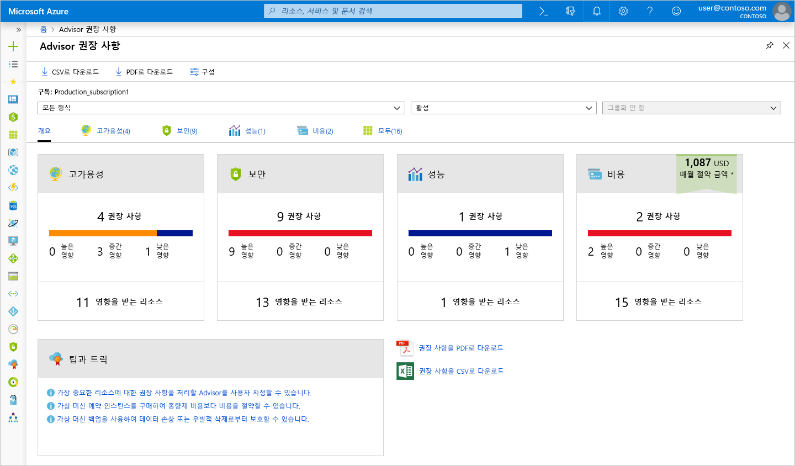
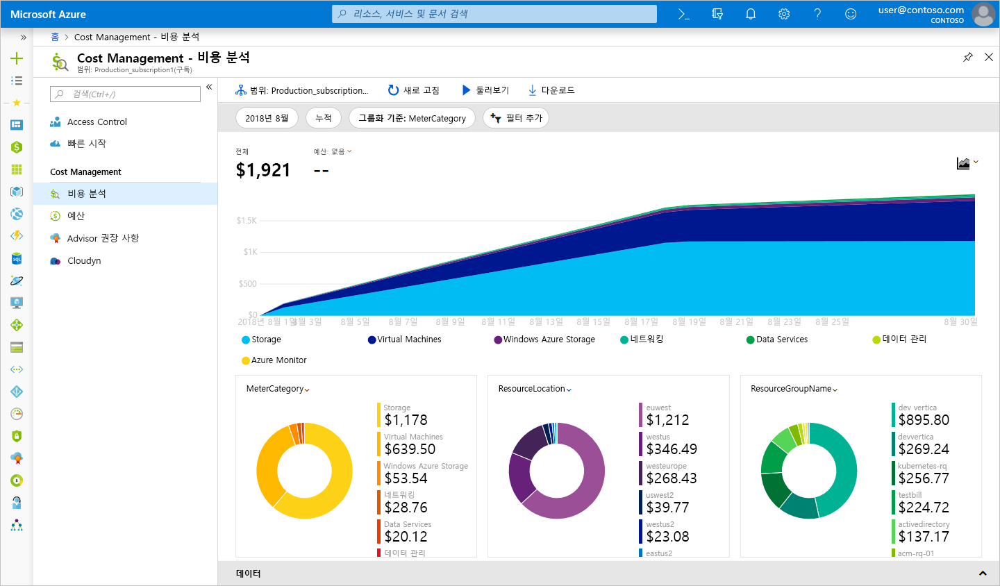
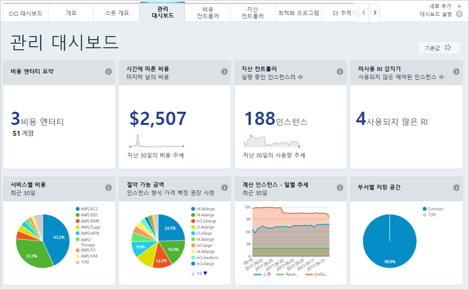

Azure에 서비스를 배포하기 전에 비용을 예상하는 방법에 대해 배웠지만 리소스가 이미 배포되어 있는 경우에는 어떻게 하나요? 이미 발생한 비용은 어떻게 파악하나요? 이전에 솔루션을 Azure에 배포했으나 가상 머신의 크기를 적절하게 지정했는지 확인하고 청구 금액이 얼마일지 예상해 볼 방법은 무엇인가요? 이 문제를 해결하는 데 사용할 수 있는 Azure의 몇 가지 도구를 살펴보겠습니다.

## Azure Advisor란?

**Azure Advisor**는 Azure에 빌드된 무료 서비스로, 고가용성과 보안, 성능, 비용에 대한 권장 사항을 제공합니다. Advisor는 배포된 서비스를 분석하여 이러한 네 영역에서 환경을 개선할 방법을 찾습니다. 여기서는 비용 권장 사항을 중점적으로 살펴보지만, 시간을 내서 다른 권장 사항도 검토해 보세요.

Advisor에서 비용 권장 사항을 제공하는 영역은 다음과 같습니다.

1. **프로비전되지 않은 Azure ExpressRoute 회로를 제거하여 비용을 절감합니다.**
    이 서비스는 공급자 상태가 1개월 넘게 ‘프로비전되지 않음’인 ExpressRoute 회로를 식별하고, 연결 공급자로 회로를 프로비전하지 않으려는 경우 회로를 삭제할 것을 권장합니다.**

1. **예약 인스턴스를 구입하여 종량제보다 비용을 절감합니다.**
    이 서비스는 지난 30일 동안의 가상 머신 사용량을 검토하여 예약 인스턴스를 구매하면 앞으로 비용을 절감할 수 있는지 확인합니다. Advisor는 잠재적으로 절감액이 가장 큰 지역과 크기를 보여주고, 예약 인스턴스 구매로 얻을 수 있는 예상 절감액을 보여줍니다.

1. **사용률이 낮은 가상 머신을 적합한 크기로 지정하거나 종료합니다.**
    이 서비스는 14일 동안 가상 머신 사용량을 모니터링하여 사용률이 낮은 가상 머신을 식별합니다. 4일 이상 평균 CPU 사용률이 5% 이하이고 네트워크 사용량이 7MB 이하인 가상 머신은 사용률이 낮은 가상 머신으로 간주됩니다. 평균 CPU 활용률 임계값은 최대 20%까지 조정 가능합니다. 이러한 가상 머신을 식별하면 더 작은 인스턴스 유형으로 크기를 조정하도록 결정하여 비용을 절감할 수 있습니다.

[!include]

포털에서 Azure Advisor를 찾을 수 있는 위치를 알아보겠습니다. 먼저에 로그인 합니다 [Azure portal](https://portal.azure.com?azure-portal=true)합니다. **모든 서비스**를 클릭하면 **관리 도구** 범주에 **Advisor**가 표시됩니다. 입력할 수도 있습니다 `Advisor` 해당 서비스만 필터링 하려면 필터 상자에 있습니다.

Advisor를 클릭하면 해당 구독에 대한 모든 권장 사항을 볼 수 있는 Advisor 권장 사항 대시보드로 이동합니다. 권장 사항 범주마다 하나의 상자가 표시됩니다.

> [!NOTE]
> Advisor에 비용에 대한 권장 사항이 없을 수도 있습니다. 평가가 아직 완료되지 않았기 때문일 수도 있고 Advisor의 권장 사항이 없기 때문일 수도 있습니다.

**비용** 상자를 클릭하면 Advisor의 권장 사항을 볼 수 있는 자세한 권장 사항으로 이동합니다.

권장 사항 하나를 클릭하면 해당 권장 사항에 대한 세부 정보로 이동합니다. 그러면 지출을 줄이도록 가상 머신 크기를 조정하는 것과 같은 특정 조치를 수행할 수 있습니다.

이러한 권장 사항은 모두 비효율적으로 비용을 지출하고 있는 부분에 대한 것입니다. 비용을 절감할 부분을 찾고 있는 경우 이러한 권장 사항을 확인하여 특정 조치를 시작하고 지속적으로 다시 방문하여 확인하면 많은 도움이 됩니다. 이 예에서는 권장 사항을 적용하는 경우 매월 약 $700를 절약할 수 있습니다. 이러한 절감액은 증가될 수 있으므로 네 영역 모두에서 권장 사항을 정기적으로 검토해야 합니다.

## Azure Cost Management

Azure Cost Management는 클라우드 비용이 발생하는 부분을 보다 확실하게 파악하기 위해 사용할 수 있는, 또 하나의 무료 기본 제공 Azure 도구입니다. 비용을 지출하는 서비스와 설정된 예산 대비 지출을 추적하는 방법에 대한 기록 분석 결과를 볼 수 있습니다. 예산을 설정하고, 보고서를 예약하고, 비용 영역을 분석할 수 있습니다.

## Cloudyn

Microsoft 자회사인 Cloudyn을 통해 Azure 리소스와 Amazon Web Services 및 Google을 포함한 다른 클라우드 공급자에 대한 클라우드 사용량 및 지출을 추적할 수 있습니다. 이해하기 쉬운 대시보드 보고서는 비용 할당 및 환불을 도울 수 있습니다. Cost Management를 통해 관리하고 조정할 수 있는 사용률이 낮은 리소스를 식별하여 클라우드 소비를 최적화할 수 있습니다. Azure에 대한 사용은 무료이며, 프리미엄 지원을 받거나 다른 클라우드의 데이터를 볼 수 있는 유료 옵션이 있습니다.

## 요약

살펴본 것처럼 Azure에서는 클라우드 지출을 추적 및 예측하는 데 사용하고 현재 환경을 비용 관점에서 볼 때 비효율적인 부분을 파악하는 데 사용할 수 있는 여러 도구를 추가 비용 없이 제공합니다. 이러한 도구에서 제공하는 보고서와 권장 사항을 정기적으로 검토하여 전체 클라우드 공간에서 비용을 절감할 수 있도록 하세요. 이제 인프라 비용을 절감하는 데 도움이 될 몇 가지 모범 사례를 살펴보겠습니다.
