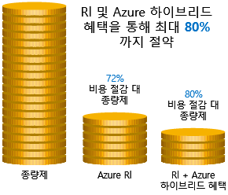
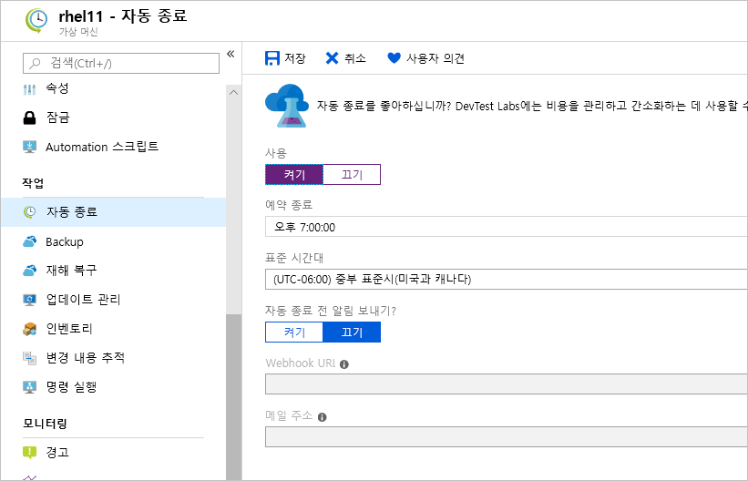

빌드하려는 환경에 대한 비용을 예상하는 방법을 알아보고, 비용이 지출되는 부분에 대한 세부 정보를 가져오는 몇 가지 도구를 살펴보고, 향후 비용을 예상해 보았습니다.We have seen how to create cost estimates for environments you'd like to build, walked through some tools to get details on where we're spending money, and projected future expenses. 다음에는 해당 인프라 비용을 절감하는 방법을 알아봅니다.Our next challenge is to look at how to reduce those infrastructure costs.

## 예약 인스턴스 사용Use reserved instances

정적이며 예측 가능한 특징을 가진 VM 워크로드가 있는 경우 특히, 연중무휴로 실행되는 워크로드가 있는 경우 예약 인스턴스 사용은 VM 크기에 따라 최대 70-80%까지 비용을 절감할 수 있는 좋은 방법입니다.If you have VM workloads that are static and predictable in nature, particularly ones that run 24x7x365, using reserved instances is a fantastic way to potentially save up to 70-80%, depending on the VM size. 다음 그림은 Azure 예약 인스턴스를 사용하면 최대 72%의 비용이 절감되고 예약 인스턴스와 Azure 하이브리드 혜택을 사용하면 최대 80%의 비용이 절감되는 것을 보여 줍니다.The following illustration shows that using Azure reserved instances saves you up to 72% and using reserved instance plus Azure Hybrid Benefit saves up to 80% in costs.

예약 인스턴스는 1년 또는 3년 기간으로 구매되며, 전체 기간에 대해 선불로 결제해야 합니다.Reserved instances are purchased in one-year or three-year terms, with payment required for the full term up front. 구매 후에는 Microsoft가 예약을 실행 중인 인스턴스에 맞춰 예약 시간을 줄입니다.After it's purchased, Microsoft matches up the reservation to running instances and decrements the hours from your reservation. 예약은 Azure Portal을 통해 구매할 수 있습니다.Reservations can be purchased through the Azure portal. 예약 인스턴스는 계산 할인에 해당하므로 Windows 및 Linux VM 둘 다에 사용할 수 있습니다.And because reserved instances are a compute discount, they are available for both Windows and Linux VMs.

## 사용률이 낮은 가상 머신을 적합한 크기로 지정Right-size underutilized virtual machines

앞에서 Azure Cost Management와 Azure Advisor는 VM을 적합한 크기로 지정하거나 종료하도록 권장할 수 있다고 설명했습니다.Recall from our previous discussion that Azure Cost Management and Azure Advisor might recommend right-sizing or shutting down VMs. 가상 머신을 적합한 크기로 지정하는 것은 가상 머신을 적당한 크기로 조정하는 프로세스입니다.Right-sizing a virtual machine is the process of resizing it to a proper size. 도메인 컨트롤러로 실행 중이며 **Standard_D4sv3**으로 크기가 지정된 서버가 있으나 VM이 대부분의 시간인 90%를 유휴 상태로 있다고 가정해 보겠습니다.Let's imagine you have a server running as a domain controller that is sized as a **Standard_D4sv3**, but your VM is sitting at 90% idle the vast majority of the time. 이 VM의 크기를 **Standard_D2sv3**으로 조정하면 계산 비용이 50% 절감됩니다.By resizing this VM to a **Standard_D2sv3**, you reduce your compute cost by 50%. 비용은 선형으로 증가하며 동일한 시리즈에서 크기가 커질 때마다 두 배가 됩니다.Costs are linear and double for each size larger in the same series. 이 경우 저렴한 VM 시리즈로 전환하여 인스턴스 시리즈 변경의 혜택을 볼 수도 있습니다.In this case, you might even benefit from changing the instance series to go to a less expensive VM series. 다음 그림은 동일한 시리즈 내에서 크기를 한 단계 아래로 이동하여 비용을 50% 절감하는 것을 보여 줍니다.The following illustration shows a 50% savings achieved by moving one size down within the same series.

과도한 크기의 가상 머신은 Azure에서 일반적인 불필요한 비용으로 쉽게 해결할 수 있습니다.Over-sized virtual machines are a common unnecessary expense on Azure and one that can be easily fixed. Azure Portal, Azure PowerShell 또는 Azure CLI를 통해 VM 크기를 변경할 수 있습니다.You can change the size of a VM through the Azure portal, Azure PowerShell, or the Azure CLI.

> [!TIP]
> VM 크기를 조정하려면 VM을 중지하고 크기를 조정한 후 다시 시작해야 합니다.Resizing a VM requires it to be stopped, resized, and then restarted. 크기 변경 규모에 따라 시간이 몇 분 정도 걸릴 수 있습니다.This may take a few minutes depending on how significant the size change is. 이 작업을 수행하는 동안에는 중단을 계획하거나 트래픽을 다른 인스턴스로 전환하세요.Plan for an outage, or shift your traffic to another instance while you perform this task.

## 작업을 하지 않는 시간에는 가상 머신 할당 취소Deallocate virtual machines in off hours

특정 기간에만 사용되는 가상 머신 워크로드를 매일 항상 실행하는 경우 비용이 낭비됩니다.If you have virtual machine workloads that are only used during certain periods of time, but you're running them every hour of every day, you're wasting money. 이러한 VM을 사용 중이 아닌 경우 종료했다가 일정에 따라 다시 시작하면 VM이 할당 취소된 동안 계산 비용을 크게 절감할 수 있습니다.These VMs are great candidates to shut down when not in use and start back up on a schedule, saving you compute costs while the VM is deallocated.

이 방법은 개발 환경에 아주 효과적인 전략입니다.This approach is a great strategy for development environments. 개발은 업무 시간 중에만 이루어지므로 작업을 하지 않는 시간에는 유연하게 해당 시스템을 할당 취소하여 계산 비용이 발생하지 않도록 하는 경우가 많습니다.It's often the case that development may happen only during business hours, giving you the flexibility to deallocate these systems in the off hours and stopping your compute costs from accruing. 이제 Azure는 사용자 환경에서 활용할 수 있는 [자동화 솔루션](https://docs.microsoft.com/azure/automation/automation-solution-vm-management)을 사용자에게 제공합니다.Azure now has an [automation solution](https://docs.microsoft.com/azure/automation/automation-solution-vm-management) fully available for you to leverage in your environment.

가상 머신에서 자동 종료 기능을 사용하여 자동 종료를 예약할 수도 있습니다.You can also use the auto-shutdown feature on a virtual machine to schedule automated shutdowns.

## 사용하지 않는 가상 머신 삭제Delete unused virtual machines

 너무 당연하게 들리겠지만 서비스를 사용하지 않는 경우에는 서비스를 종료해야 합니다.This advice may sound obvious, but if you aren't using a service, you should shut it down. 더 이상 필요하지 않은 프로젝트 이후 비프로덕션 시스템이나 개념 증명 시스템이 그대로 남아 있는 경우가 많습니다.It's not uncommon to find non-production or proof-of-concept systems left around following a project that is no longer needed. 정기적으로 환경을 검토하여 이러한 시스템을 파악하세요.Regularly review your environment and work to identify these systems. 이러한 시스템을 종료하면 인프라 비용이 절약될 뿐만 아니라 라이선싱 및 운영 비용도 잠재적으로 절약되므로 다양한 혜택을 얻을 수 있습니다.Shutting down these systems can have a multifaceted benefit by saving you not only on infrastructure costs but also potential savings on licensing and operations.

## PaaS 또는 SaaS 서비스로 마이그레이션Migrate to PaaS or SaaS services

마지막으로, 워크로드를 클라우드로 이동하면 자연스럽게 IaaS(Infrastructure as a Service) 서비스를 통해 혁신이 시작되고 반복 프로세스로 적절하게 PaaS(Platform as a Service)로 이동합니다.Lastly, as you move workloads to the cloud, a natural evolution is to start with infrastructure-as-a-service (IaaS) services and then move them to platform-as-a-service (PaaS) as appropriate, in an iterative process.

PaaS 서비스를 사용하면 일반적으로 리소스 및 운영 비용이 둘 다 상당히 절약됩니다.PaaS services typically provide substantial savings in both resource and operational costs. 이러한 서비스로 이동할 때 서비스 유형에 따라 시간 및 리소스 측면에서 다양한 수준의 노력이 필요할 수 있습니다.The challenge is that depending on the type of service, varying levels of effort will be required to move to these services from both a time and resource perspective. SQL Server 데이터베이스는 쉽게 Azure SQL Database로 이동할 수 있지만 다중 계층 응용 프로그램을 컨테이너 또는 서버리스 기반 아키텍처로 이동하는 데는 훨씬 더 큰 노력이 필요할 수 있습니다.You might be able to easily move a SQL Server database to Azure SQL Database, but it might take substantially more effort to move your multitier application to a container or serverless-based architecture. 응용 프로그램 아키텍처를 지속적으로 평가하여 PaaS 서비스를 통해 효율성을 높일 수 있는지 확인하는 것이 좋습니다.It's a good practice to continuously evaluate the architecture of your applications to determine if there are efficiencies to be gained through PaaS services.

Azure를 사용하면 이러한 서비스를 거의 위험 없이 쉽게 테스트할 수 있으므로 새로운 아키텍처 패턴도 비교적 쉽게 사용해 볼 수 있습니다.Azure makes it easy to test these services with little risk, giving you the ability to try out new architecture patterns relatively easily. 그렇기는 하지만 비용 절감에는 일반적으로 많은 과정이 필요하며 빠른 성과를 거두려는 경우 당장에는 도움이 되지 않을 수도 있습니다.That said, it's typically a longer journey and might not be of immediate help if you're looking for quick wins from a cost-savings perspective. Azure 아키텍처 센터는 응용 프로그램 혁신을 위한 아이디어를 얻을 뿐만 아니라 광범위한 아키텍처 및 Azure 서비스의 모범 사례를 확인하기 좋은 곳입니다.The Azure Architecture Center is a great place to get ideas for transforming your application, as well as best practices across a wide array of architectures and Azure services.
