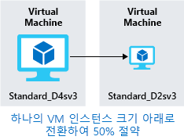

빌드하려는 환경에 대한 비용을 예상하는 방법을 알아보고, 비용이 지출되는 부분에 대한 세부 정보를 가져오는 몇 가지 도구를 살펴보고, 향후 비용을 예상해 보았습니다. 다음에는 해당 인프라 비용을 절감하는 방법을 알아봅니다.

## 예약 인스턴스 사용

정적이며 예측 가능한 특징을 가진 VM 워크로드가 있는 경우 특히, 연중무휴로 실행되는 워크로드가 있는 경우 예약 인스턴스 사용은 VM 크기에 따라 최대 70-80%까지 비용을 절감할 수 있는 좋은 방법입니다. 다음 그림은 Azure 예약 인스턴스를 사용하면 최대 72%의 비용이 절감되고 예약 인스턴스와 Azure 하이브리드 혜택을 사용하면 최대 80%의 비용이 절감되는 것을 보여 줍니다.

예약 인스턴스는 1년 또는 3년 기간으로 구매되며, 전체 기간에 대해 선불로 결제해야 합니다. 구매 후에는 Microsoft가 예약을 실행 중인 인스턴스에 맞춰 예약 시간을 줄입니다. 예약은 Azure Portal을 통해 구매할 수 있습니다. 예약 인스턴스는 계산 할인에 해당하므로 Windows 및 Linux VM 둘 다에 사용할 수 있습니다.

## 사용률이 낮은 가상 머신을 적합한 크기로 지정

앞에서 Azure Cost Management와 Azure Advisor는 VM을 적합한 크기로 지정하거나 종료하도록 권장할 수 있다고 설명했습니다. 가상 머신을 적합한 크기로 지정하는 것은 가상 머신을 적당한 크기로 조정하는 프로세스입니다. 도메인 컨트롤러로 실행 중이며 **Standard_D4sv3**으로 크기가 지정된 서버가 있으나 VM이 대부분의 시간인 90%를 유휴 상태로 있다고 가정해 보겠습니다. 이 VM의 크기를 **Standard_D2sv3**으로 조정하면 계산 비용이 50% 절감됩니다. 비용은 선형으로 증가하며 동일한 시리즈에서 크기가 커질 때마다 두 배가 됩니다. 이 경우 저렴한 VM 시리즈로 전환하여 인스턴스 시리즈 변경의 혜택을 볼 수도 있습니다. 다음 그림은 동일한 시리즈 내에서 크기를 한 단계 아래로 이동하여 비용을 50% 절감하는 것을 보여 줍니다.

과도한 크기의 가상 머신은 Azure에서 일반적인 불필요한 비용으로 쉽게 해결할 수 있습니다. Azure Portal, Azure PowerShell 또는 Azure CLI를 통해 VM 크기를 변경할 수 있습니다.

> [!TIP]
> VM 크기를 조정하려면 VM을 중지하고 크기를 조정한 후 다시 시작해야 합니다. 크기 변경 규모에 따라 시간이 몇 분 정도 걸릴 수 있습니다. 이 작업을 수행하는 동안에는 중단을 계획하거나 트래픽을 다른 인스턴스로 전환하세요.

## 작업을 하지 않는 시간에는 가상 머신 할당 취소

특정 기간에만 사용되는 가상 머신 워크로드를 매일 항상 실행하는 경우 비용이 낭비됩니다. 이러한 VM을 사용 중이 아닌 경우 종료했다가 일정에 따라 다시 시작하면 VM이 할당 취소된 동안 계산 비용을 크게 절감할 수 있습니다.

이 방법은 개발 환경에 아주 효과적인 전략입니다. 개발은 업무 시간 중에만 이루어지므로 작업을 하지 않는 시간에는 유연하게 해당 시스템을 할당 취소하여 계산 비용이 발생하지 않도록 하는 경우가 많습니다. 이제 Azure는 사용자 환경에서 활용할 수 있는 [자동화 솔루션](https://docs.microsoft.com/azure/automation/automation-solution-vm-management)을 사용자에게 제공합니다.

가상 머신에서 자동 종료 기능을 사용하여 자동 종료를 예약할 수도 있습니다.

## 사용하지 않는 가상 머신 삭제

 너무 당연하게 들리겠지만 서비스를 사용하지 않는 경우에는 서비스를 종료해야 합니다. 더 이상 필요하지 않은 프로젝트 이후 비프로덕션 시스템이나 개념 증명 시스템이 그대로 남아 있는 경우가 많습니다. 정기적으로 환경을 검토하여 이러한 시스템을 파악하세요. 이러한 시스템을 종료하면 인프라 비용이 절약될 뿐만 아니라 라이선싱 및 운영 비용도 잠재적으로 절약되므로 다양한 혜택을 얻을 수 있습니다.

## PaaS 또는 SaaS 서비스로 마이그레이션

마지막으로, 워크로드를 클라우드로 이동하면 자연스럽게 IaaS(Infrastructure as a Service) 서비스를 통해 혁신이 시작되고 반복 프로세스로 적절하게 PaaS(Platform as a Service)로 이동합니다.

PaaS 서비스를 사용하면 일반적으로 리소스 및 운영 비용이 둘 다 상당히 절약됩니다. 이러한 서비스로 이동할 때 서비스 유형에 따라 시간 및 리소스 측면에서 다양한 수준의 노력이 필요할 수 있습니다. SQL Server 데이터베이스는 쉽게 Azure SQL Database로 이동할 수 있지만 다중 계층 응용 프로그램을 컨테이너 또는 서버리스 기반 아키텍처로 이동하는 데는 훨씬 더 큰 노력이 필요할 수 있습니다. 응용 프로그램 아키텍처를 지속적으로 평가하여 PaaS 서비스를 통해 효율성을 높일 수 있는지 확인하는 것이 좋습니다.

Azure를 사용하면 이러한 서비스를 거의 위험 없이 쉽게 테스트할 수 있으므로 새로운 아키텍처 패턴도 비교적 쉽게 사용해 볼 수 있습니다. 그렇기는 하지만 비용 절감에는 일반적으로 많은 과정이 필요하며 빠른 성과를 거두려는 경우 당장에는 도움이 되지 않을 수도 있습니다. Azure 아키텍처 센터는 응용 프로그램 혁신을 위한 아이디어를 얻을 뿐만 아니라 광범위한 아키텍처 및 Azure 서비스의 모범 사례를 확인하기 좋은 곳입니다.