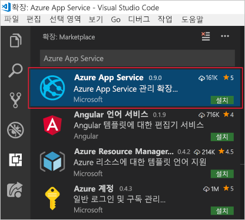

<span data-ttu-id="4cd0c-101">Azure 개발을 위해 Visual Studio Code를 사용하려면 Visual Studio Code를 로컬에 설치하고 하나 이상의 Azure 확장을 설치해야 합니다.</span><span class="sxs-lookup"><span data-stu-id="4cd0c-101">To use Visual Studio Code for Azure development, you'll need to install Visual Studio Code locally and one or more Azure extensions.</span></span> <span data-ttu-id="4cd0c-102">이 연습에서는 **Azure App Service** 확장을 추가합니다.</span><span class="sxs-lookup"><span data-stu-id="4cd0c-102">In this exercise, we'll add the **Azure App Service** extension.</span></span>

## <a name="install-visual-studio-code"></a><span data-ttu-id="4cd0c-103">Visual Studio Code 설치</span><span class="sxs-lookup"><span data-stu-id="4cd0c-103">Install Visual Studio Code</span></span>

<span data-ttu-id="4cd0c-104">::: zone pivot="windows"</span><span class="sxs-lookup"><span data-stu-id="4cd0c-104">::: zone pivot="windows"</span></span>

### <a name="windows"></a><span data-ttu-id="4cd0c-105">Windows</span><span class="sxs-lookup"><span data-stu-id="4cd0c-105">Windows</span></span>

1. <span data-ttu-id="4cd0c-106">[Windows용 Visual Studio Code 설치 관리자를 다운로드](https://code.visualstudio.com/)합니다.</span><span class="sxs-lookup"><span data-stu-id="4cd0c-106">[Download the Visual Studio Code installer for Windows](https://code.visualstudio.com/).</span></span>

1. <span data-ttu-id="4cd0c-107">설치 관리자를 실행합니다.</span><span class="sxs-lookup"><span data-stu-id="4cd0c-107">Run the installer.</span></span>

1. <span data-ttu-id="4cd0c-108">Windows 키를 누르거나 작업 표시줄에서 Windows 아이콘을 클릭하고, "Visual Studio Code"를 입력하고, **Visual Studio Code** 결과를 클릭하여 Visual Studio Code를 엽니다.</span><span class="sxs-lookup"><span data-stu-id="4cd0c-108">Open Visual Studio Code by pressing the Windows key or clicking the Windows icon on the task bar, typing "Visual Studio Code" and clicking on the **Visual Studio Code** result.</span></span>

<span data-ttu-id="4cd0c-109">::: zone-end</span><span class="sxs-lookup"><span data-stu-id="4cd0c-109">::: zone-end</span></span>

<span data-ttu-id="4cd0c-110">::: zone pivot="macos"</span><span class="sxs-lookup"><span data-stu-id="4cd0c-110">::: zone pivot="macos"</span></span>

### <a name="macos"></a><span data-ttu-id="4cd0c-111">macOS</span><span class="sxs-lookup"><span data-stu-id="4cd0c-111">macOS</span></span>

1. <span data-ttu-id="4cd0c-112">[macOS용 Visual Studio Code를 다운로드](https://code.visualstudio.com/)합니다.</span><span class="sxs-lookup"><span data-stu-id="4cd0c-112">[Download Visual Studio Code for macOS](https://code.visualstudio.com/).</span></span>

1. <span data-ttu-id="4cd0c-113">다운로드한 보관 파일을 두 번 클릭하여 콘텐츠를 확장합니다.</span><span class="sxs-lookup"><span data-stu-id="4cd0c-113">Double-click on the downloaded archive to expand the contents.</span></span>

1. <span data-ttu-id="4cd0c-114">Visual Studio Code.app을 응용 프로그램 폴더로 끕니다.</span><span class="sxs-lookup"><span data-stu-id="4cd0c-114">Drag Visual Studio Code.app to the Applications folder.</span></span>

1. <span data-ttu-id="4cd0c-115">앱 섹션 아이콘을 클릭하거나 Spotlight에서 Visual Studio Code를 검색하여 Visual Studio Code를 엽니다.</span><span class="sxs-lookup"><span data-stu-id="4cd0c-115">Open Visual Studio Code by clicking on the icon the Apps section or by searching for Visual Studio Code in Spotlight.</span></span>

<span data-ttu-id="4cd0c-116">::: zone-end</span><span class="sxs-lookup"><span data-stu-id="4cd0c-116">::: zone-end</span></span>

<span data-ttu-id="4cd0c-117">::: zone pivot="linux"</span><span class="sxs-lookup"><span data-stu-id="4cd0c-117">::: zone pivot="linux"</span></span>

### <a name="linux"></a><span data-ttu-id="4cd0c-118">Linux</span><span class="sxs-lookup"><span data-stu-id="4cd0c-118">Linux</span></span> 

#### <a name="debian-and-ubuntu"></a><span data-ttu-id="4cd0c-119">Debian 및 Ubuntu</span><span class="sxs-lookup"><span data-stu-id="4cd0c-119">Debian and Ubuntu</span></span>

1. <span data-ttu-id="4cd0c-120">그래픽 소프트웨어 센터(사용 가능한 경우) 또는 명령줄(`<file>`을 다운로드한 .deb 파일 이름으로 바꿈)을 통해 [.deb 패키지(64비트)](https://go.microsoft.com/fwlink/?LinkID=760868)를 다운로드하여 설치합니다.</span><span class="sxs-lookup"><span data-stu-id="4cd0c-120">Download and install the [.deb package (64-bit)](https://go.microsoft.com/fwlink/?LinkID=760868) through the graphical software center, if it's available, or through the command line (replacing `<file>` with the .deb filename you downloaded):</span></span>

    ```bash
    sudo dpkg -i <file>.deb
    sudo apt-get install -f # Install dependencies
    ```

#### <a name="rhel-fedora-and-centos"></a><span data-ttu-id="4cd0c-121">RHEL, Fedora 및 CentOS</span><span class="sxs-lookup"><span data-stu-id="4cd0c-121">RHEL, Fedora, and CentOS</span></span>

1. <span data-ttu-id="4cd0c-122">다음 스크립트를 사용하여 키 및 리포지토리를 설치합니다.</span><span class="sxs-lookup"><span data-stu-id="4cd0c-122">Use the following script to install the key and repository:</span></span>

    ```bash
    sudo rpm --import https://packages.microsoft.com/keys/microsoft.asc
    sudo sh -c 'echo -e "[code]\nname=Visual Studio Code\nbaseurl=https://packages.microsoft.com/yumrepos/vscode\nenabled=1\ngpgcheck=1\ngpgkey=https://packages.microsoft.com/keys/microsoft.asc" > /etc/yum.repos.d/vscode.repo'
    ```

1. <span data-ttu-id="4cd0c-123">패키지 캐시를 업데이트하고 dnf(Fedora 22 이상)를 사용하여 패키지를 설치합니다.</span><span class="sxs-lookup"><span data-stu-id="4cd0c-123">Update the package cache, and install the package by using dnf (Fedora 22 and above):</span></span>

    ```bash
    dnf check-update
    sudo dnf install code
    ```

#### <a name="opensuse-and-sle"></a><span data-ttu-id="4cd0c-124">openSUSE 및 SLE</span><span class="sxs-lookup"><span data-stu-id="4cd0c-124">openSUSE and SLE</span></span>

1. <span data-ttu-id="4cd0c-125">yum 리포지토리는 openSUSE 및 SLE 기반 시스템에 대해서도 작동합니다.</span><span class="sxs-lookup"><span data-stu-id="4cd0c-125">The yum repository also works for openSUSE and SLE based systems.</span></span> <span data-ttu-id="4cd0c-126">다음 스크립트는 키 및 리포지토리를 설치합니다.</span><span class="sxs-lookup"><span data-stu-id="4cd0c-126">The following script will install the key and repository:</span></span>

    ```bash
    sudo rpm --import https://packages.microsoft.com/keys/microsoft.asc
    sudo sh -c 'echo -e "[code]\nname=Visual Studio Code\nbaseurl=https://packages.microsoft.com/yumrepos/vscode\nenabled=1\ntype=rpm-md\ngpgcheck=1\ngpgkey=https://packages.microsoft.com/keys/microsoft.asc" > /etc/zypp/repos.d/vscode.repo'
    ```

1. <span data-ttu-id="4cd0c-127">패키지 캐시를 업데이트하고 다음을 사용하여 패키지를 설치합니다.</span><span class="sxs-lookup"><span data-stu-id="4cd0c-127">Update the package cache and install the package by using:</span></span>

    ```bash
    sudo zypper refresh
    sudo zypper install code
    ```

> [!NOTE]
> <span data-ttu-id="4cd0c-128">다양한 Linux 배포에 Visual Studio Code를 설치하거나 업데이트하는 방법에 대한 자세한 내용은 [Linux에서 Visual Studio Code 실행 설명서](https://code.visualstudio.com/docs/setup/linux)를 참조하세요.</span><span class="sxs-lookup"><span data-stu-id="4cd0c-128">For further details about installing or updating Visual Studio Code on various Linux distributions, please see the [Running Visual Studio Code on Linux documentation](https://code.visualstudio.com/docs/setup/linux).</span></span>

<span data-ttu-id="4cd0c-129">::: zone-end</span><span class="sxs-lookup"><span data-stu-id="4cd0c-129">::: zone-end</span></span>

## <a name="install-azure-app-service-extension"></a><span data-ttu-id="4cd0c-130">Azure App Service 확장 설치</span><span class="sxs-lookup"><span data-stu-id="4cd0c-130">Install Azure App Service extension</span></span>

1. <span data-ttu-id="4cd0c-131">아직 설치하지 않은 경우 Visual Studio Code를 엽니다.</span><span class="sxs-lookup"><span data-stu-id="4cd0c-131">If you haven't already, open Visual Studio Code.</span></span>

1. <span data-ttu-id="4cd0c-132">확장 브라우저를 엽니다. 왼쪽 메뉴를 통해 액세스할 수 있습니다.</span><span class="sxs-lookup"><span data-stu-id="4cd0c-132">Open the Extensions browser; it's accessed via the menu on the left.</span></span>

1. <span data-ttu-id="4cd0c-133">**Azure App Service**를 검색합니다.</span><span class="sxs-lookup"><span data-stu-id="4cd0c-133">Search for **Azure App Service**.</span></span>

1. <span data-ttu-id="4cd0c-134">**Azure App Service** 결과를 선택하고 **설치**를 클릭합니다.</span><span class="sxs-lookup"><span data-stu-id="4cd0c-134">Select the **Azure App Service** result and click **Install**.</span></span>

    <span data-ttu-id="4cd0c-135">다음 스크린샷은 Visual Studio Code 확장 검색 결과에서 Azure App Service 확장이 선택되어 있는 것을 보여 줍니다.</span><span class="sxs-lookup"><span data-stu-id="4cd0c-135">The following screenshot shows the Azure App Service extension selected from the Visual Studio Code extension search results.</span></span>

    

<span data-ttu-id="4cd0c-137">이렇게 하면 확장이 설치됩니다.</span><span class="sxs-lookup"><span data-stu-id="4cd0c-137">This will install the extension.</span></span> <span data-ttu-id="4cd0c-138">Azure 구독에 연결하고 Azure App Service에 웹, 모바일 또는 API 앱을 배포할 준비가 되었습니다.</span><span class="sxs-lookup"><span data-stu-id="4cd0c-138">You're now ready to connect to your Azure subscription and deploy a web, mobile, or API app to an Azure App Service.</span></span>
