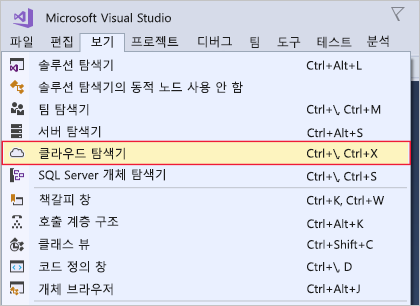

여기에서는 Windows 또는 macOS 개발 머신에 Visual Studio를 설치합니다.

## 연습 단계

::: zone pivot="windows"

### Windows

1. https://visualstudio.microsoft.com/downloads/에서 Visual Studio 설치 관리자를 다운로드합니다.

1. 설치 관리자를 실행합니다.

1. **워크로드** 탭에서 **Azure 개발** 워크로드를 선택합니다.

    다음 스크린샷은 Visual Studio 내에서 Azure 개발을 허용하도록 Visual Studio 설치 관리자 워크로드가 선택되어 있는 것을 보여 줍니다.

    

1. (선택 사항) ASP.NET 및 웹 개발 워크로드를 설치하여 Azure용 웹 응용 프로그램을 만들 준비를 합니다.

1. **설치**를 클릭하고 Visual Studio가 설치될 때까지 기다립니다. Visual Studio가 이미 설치된 시스템의 경우 이 단추는 **수정**을 나타냅니다.

1. 설치가 완료되면 Visual Studio를 엽니다.

1. Visual Studio의 보기 메뉴로 이동하여 **클라우드 탐색기** 옵션이 있는지 확인합니다.

    다음 스크린샷은 Azure 개발 워크로드가 설치되어 있으면 표시되는 클라우드 탐색기 메뉴 옵션을 보여 줍니다.

    

::: zone-end

::: zone pivot="macos"

### macOS

1. https://visualstudio.microsoft.com/으로 이동하여 Mac용 Visual Studio 설치 관리자를 다운로드합니다.

1. VisualStudioInstaller.dmg 파일을 클릭하여 설치 관리자를 탑재한 후, 로고를 두 번 클릭하여 설치 관리자를 실행합니다.

1. 개인정보처리방침 및 라이선스 조건이 표시되면 동의합니다.

1. 설치 관리자에서 설치할 구성 요소를 물어봅니다. Azure 구성 요소는 이미 Mac용 Visual Studio의 일부이지만 Azure용 웹 환경을 개발하려면 **.NET Core** 플랫폼을 설치하는 것이 좋습니다.

    다음 스크린샷은 Mac용 Visual Studio에 Azure 개발 기능을 추가하는 데 필요한 .NET Core 플랫폼을 보여 줍니다.

    

1. 선택 사항에 만족하면 **설치 및 업데이트**를 클릭하고 설치 관리자가 완료될 때까지 기다립니다.

1. 필요한 권한을 승격하도록 메시지가 표시되면 관리자 자격 증명을 사용하여 권한을 승격합니다.

1. 설치 관리자가 완료되면 Mac용 Visual Studio를 시작합니다.

::: zone-end