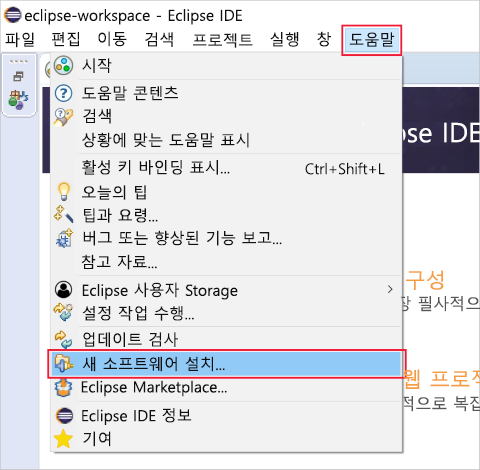
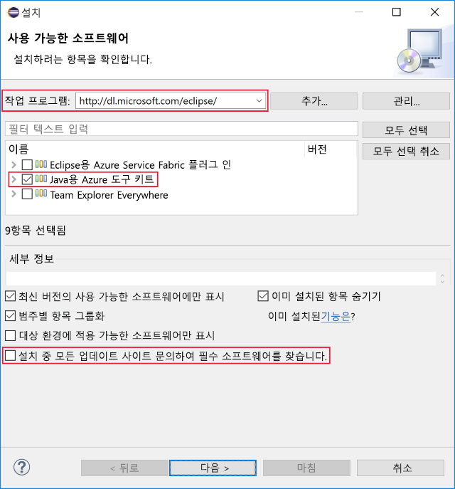

이 단원에서는 로컬 머신에 Eclipse 및 Azure 도구 키트를 설치합니다.In this unit, you will install Eclipse and the Azure Toolkit on your local machine. 설치는 빠르고 간단합니다.The installation is quick and simple. 연습이 끝나면 Azure에서 첫 번째 Java 응용 프로그램을 만드는 데 필요한 모든 것이 있게 됩니다.At the end of the exercise, you will have everything you need to create your first Java application on Azure.

## Eclipse IDE 설치Install Eclipse IDE

1. http://www.eclipse.org/downloads/packages/installer에서 운영 체제에 맞는 Eclipse 버전을 다운로드합니다.Download the Eclipse version that suits your operating system from http://www.eclipse.org/downloads/packages/installer.

1. 다운로드한 후 Eclipse 설치 관리자를 시작합니다.Start the Eclipse installer once downloaded.

    1. Windows에서 다운로드한 파일을 두 번 클릭합니다.On Windows, double-click the downloaded file.

    1. macOS 및 Linux에서, 다운로드된 파일의 설치 관리자 압축을 풀고 실행합니다.On macOS and Linux, unzip the installer from the downloaded file and run it.

        > [!NOTE]
        > Java Development Kit가 누락된 경우 설치 관리자에 설치하라는 메시지가 표시됩니다.The installer may prompt you to install the Java Development Kit, if it is missing.

1. 설치할 패키지를 선택합니다.Select the packages to install. Java 개발자의 경우 Java 또는 Java EE Eclipse IDE 옵션을 선택합니다.For Java developers, choose either the Java or Java EE Eclipse IDE option.

1. 머신에서 설치 대상을 선택합니다.Select the installation destination on your machine.

1. Eclipse를 시작하여 제대로 설치되었는지 유효성을 검사합니다.Launch Eclipse to validate that it installed correctly.

## Eclipse용 Azure 도구 키트 설치Install Azure Toolkit for Eclipse

Azure Toolkit는 Windows, macOS 및 Linux에서 동일하게 설치됩니다.Installing the Azure Toolkit is the same across Windows, macOS, and Linux.

1. Eclipse를 시작합니다.Start Eclipse.

1. **도움말** > **새 소프트웨어 설치...** 로 이동합니다.Go to **Help** > **Install New Software...**.

    다음 스크린샷은 **새 소프트웨어 설치...** 항목의 메뉴 위치를 보여 줍니다.The following screenshot shows the menu location of the **Install New Software...** item.

    

1. **사용 가능한 소프트웨어** 대화 상자가 열립니다.The **Available Software** dialog will open. **작업:** 텍스트 상자에 `http://dl.microsoft.com/eclipse/`를 입력하고 Enter 키를 누릅니다.In the **Work with:** text box, type `http://dl.microsoft.com/eclipse/` and press Enter.

1. 결과에서 **Azure Toolkit for Java** 옵션을 선택합니다.In the results, check the **Azure Toolkit for Java** option. **Contact all update sites during install to find required software**(설치 중 모든 업데이트 사이트에 문의하여 필요한 소프트웨어 찾기) 옵션이 선택 취소되어 있지 않은 경우 선택 취소해야 합니다.Make sure you uncheck the **Contact all update sites during install to find required software** option, if it isn't already.

    다음 스크린샷은 위에 설명된 **사용 가능한 소프트웨어** 설치 구성을 보여 줍니다.The following screenshot shows the **Available Software** install configuration as described above.

    

1. **다음**을 클릭합니다.Click **Next**.

1. 메시지가 표시되면 사용권 계약을 검토 및 동의하고 **완료**를 클릭합니다.Review and accept the license agreements when prompted, and click **Finish**.

1. Eclipse는 Azure Toolkit를 다운로드하여 설치합니다.Eclipse will download and install the Azure Toolkit.

1. 필요한 경우 Eclipse를 다시 시작합니다.Restart Eclipse if required.

1. Eclipse에서 **도구** > **Azure** 메뉴 옵션을 찾을 수 있는지 확인하여 Azure Toolkit 설치 유효성을 검사합니다.Validate the Azure Toolkit installation by verifying that you can find a **Tools** > **Azure** menu option in Eclipse.

## 요약Summary

이 단원에서는 Eclipse를 설치하고 Azure 서비스 및 제품과 통합하여 활용할 수 있도록 준비했습니다.In this unit, you installed Eclipse and prepared it to take advantage of the integration with Azure services and products.