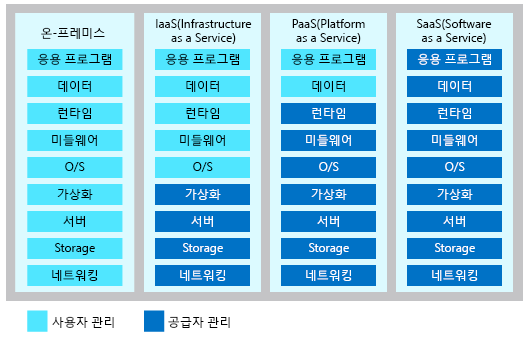

클라우드 컴퓨팅과 관련해서 세 가지 주요 범주가 있습니다. 세 가지 범주는 대화, 문서화 및 교육에 사용되므로 잘 알아두어야 합니다.

## 클라우드 컴퓨팅의 세 가지 범주 알아보기

> [!VIDEO https://www.microsoft.com/videoplayer/embed/RE2yEbs]

:::row:::
  :::column:::
    
  :::column-end:::
  ::: 열 범위 = "3"::: **인프라 (IaaS) 서비스**

Infrastructure as a Service는 클라우드 서비스에서 가장 유연한 범주입니다. 응용 프로그램을 실행하는 하드웨어를 완벽하게 제어할 수 있도록 하는 것이 목표입니다. IaaS를 사용하면 하드웨어를 구입하지 않고 대여합니다.
  :::column-end:::
:::row-end:::

:::row:::
  :::column:::
    
  :::column-end:::
  ::: 열 범위 = "3"::: **Platform-as-a-service (PaaS)**

PaaS는 소프트웨어 응용 프로그램을 빌드, 테스트 및 배포하는 환경을 제공합니다. PaaS의 목표는 기본 인프라 관리에 신경 쓰지 않고 최대한 빨리 응용 프로그램을 만들 수 있도록 지원하는 것입니다. 예를 들어 PaaS를 사용하여 웹 응용 프로그램을 배포하는 경우 운영 체제, 웹 서버 또는 시스템 업데이트조차 설치할 필요가 없습니다.
  :::column-end:::
:::row-end:::

:::row:::
  :::column:::
    
  :::column-end:::
  ::: 열 범위 = "3"::: **서비스 (SaaS) 형태의 소프트웨어**

SaaS는 최종 고객을 위해 중앙에서 호스트되고 관리되는 소프트웨어입니다. 이 서비스는 일반적으로 모든 고객이 한 가지 응용 프로그램 버전을 사용하고 월간 또는 연간 구독을 통해 라이선스가 부여되는 아키텍처를 기반으로 합니다 Office 365는 SaaS 소프트웨어의 좋은 예입니다.
  :::column-end:::
:::row-end:::

## 서비스 범주에 레이어 개념 적용

한 가지 이해해야 할 사항은 이러한 범주가 서로 다른 레이어를 기반으로 하는 레이어라는 점입니다. 예를 들어 PaaS는 추상화 수준을 제공하여 IaaS 위에 계층을 추가합니다. 추상화를 사용하면 더 빠르게 코딩할 수 있도록 중요하지 않은 세부 정보를 숨기는 혜택이 있습니다. 대신, 기본 하드웨어에 대한 제어가 약화되는 단점도 발생합니다. 다음 그림은 사용자가 관리하는 리소스와 각 클라우드 서비스 범주에서 서비스 공급자가 관리하는 리소스의 목록을 보여 줍니다.

## 요약

IaaS, PaaS 및 SaaS 각각에는 서로 다른 수준의 관리 서비스가 포함됩니다. 이러한 유형의 인프라는 쉽게 조합하여 사용할 수 있습니다. 회사 컴퓨터에서 Office 365를 사용(SaaS)할 수 있고 Azure에서 VM을 호스트(IaaS)하고 Azure SQL Database를 사용하여 데이터를 저장(PaaS)할 수 있습니다. 클라우드는 유연하기 때문에 최상의 결과를 제공하는 모든 조합을 사용할 수 있습니다.
