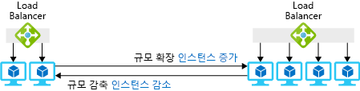

하나의 대형 가상 머신 또는 VM 간에 요청을 분배하는 부하 분산 장치가 있는 여러 개의 소형 VM을 사용하여 필요한 리소스를 확보할 수 있습니다.You can get the resources you need using either one large virtual machine or several small VMs with a load balancer to distribute requests among the VMs.

VM 풀에는 수요가 변경될 때 VM을 빠르게 추가하거나 제거할 수 있다는 장점이 있습니다.The VM pool has the nice advantage that you can add or remove VMs quickly when demand changes. 장난감 회사 시나리오에서 이 전략은 예기치 않은 수요 급증을 처리하는 데 유용합니다.In the toy company scenario, this strategy would be useful to handle unexpected spikes in demand. 수요가 증가하면 풀에 VM을 추가하고, 수요가 정상으로 돌아오면 이를 제거할 수 있습니다.You could add VMs to the pool when demand increased and remove them when demand returned to normal. 또한 풀은 중복성을 제공합니다. 한 VM에 장애가 발생하면 다른 VM에서 중단 없이 서비스를 계속 처리할 수 있습니다.The pool also gives you redundancy; if one VM fails, the others can continue to handle requests with no interruption in service.

이 단원에서는 확장 집합을 사용하여 여러 VM을 프로비전하는 방법과 변화하는 요구에 따라 인스턴스를 자동으로 추가하거나 제거하는 방법을 설명합니다.In this section, you will see how to provision multiple VMs using scale sets and how to automatically add and remove instances in response to changing demand. 

## 수평적 크기 조정이란?What is horizontal scaling?

*수평적 크기 조정*은 풀에서 가상 머신을 추가하거나 제거하여 사용 가능한 리소스의 크기를 조정하는 프로세스입니다.*Horizontal scaling* is the process of adding or removing virtual machines from a pool to adjust the amount of available resources. 머신을 추가하는 작업은 _규모 확장_이라고 하며, 머신을 제거하는 작업은 _규모 감축_이라고 합니다.Adding machines is called _scaling out_, and removing machines is called _scaling in_. 수평적 크기 조정을 사용하는 솔루션에는 풀의 VM 간에 요청을 분산시키는 부하 분산 장치 또는 게이트웨이가 포함됩니다.Solutions that use horizontal scaling include a load balancer or gateway to distribute requests among the VMs in the pool. 다음 그림에서는 가상 머신 인스턴스의 수를 변경하는 예를 보여 줍니다.The following illustration shows an example of changing the number of virtual machine instances.

이 기술은 여러 개의 동일한 서버에서 실행될 수 있는 응용 프로그램에 가장 적합합니다.This technique works best for applications that can be run across multiple, identical servers. 예를 들어 웹 서버와 웹 페이지를 여러 VM에 복제할 수 있으며, 요청을 받는 서버에 관계없이 모두 동일한 응답을 제공합니다.For example, you can duplicate your web server and web pages on multiple VMs, and they will all give the same response no matter which server receives the request. 반면에 백 엔드 데이터베이스를 실행하는 VM은 여러 개의 데이터베이스 복사본을 실행하기 위해 복사본을 동기화된 상태로 유지해야 하므로 적합한 후보가 아닙니다.On the other hand, a VM that runs your backend database is not an ideal candidate because running multiple copies of the database requires some effort to keep the copies in sync.

## 확장 집합이란?What is a scale set?

*확장 집합*은 동일한 가상 머신 풀, 요청을 분산시키는 부하 분산 장치 또는 게이트웨이 및 VM이 풀에서 추가되거나 제거되는 경우를 제어하는 선택적 규칙 집합으로 구성된 풀입니다.A *scale set* is a pool of identical virtual machines, a load balancer or gateway to distribute requests, and an optional set of rules that control when VMs are added or removed from the pool. 여기서 "동일함"은 집합의 각 VM이 동일한 이미지를 사용하여 만들어지고 동일한 크기임을 의미합니다.Here, "identical" means that each VM in the set is created using the same image and has the same size.

새 VM을 필요한 소프트웨어로 구성하는 방법에는 약간의 유연성이 있습니다.You have some flexibility in how a new VM is configured with the software you need. 기본 OS에 대해 미리 정의된 이미지로 시작한 다음, OS가 설정되면 스크립트를 사용하여 파일을 자동으로 설치하거나 복사할 수 있습니다.You can start with a predefined image for the base OS and then use scripts to install or copy files automatically after the OS is set up. 또는 운영 체제와 응용 프로그램 소프트웨어가 이미 설치되어 있는 사용자 지정 가상 머신 이미지를 만들 수 있습니다.Alternately, you can create a custom virtual machine image with the operating system and your application software already installed.

## 요청을 분산하는 방법How to distribute requests

부하 분산 장치 또는 응용 프로그램 게이트웨이 중 하나를 사용하여 확장 집합의 VM 인스턴스에 요청을 분산할 수 있습니다.You can use either a load balancer or an application gateway to distribute requests to the VM instances in a scale set.

Azure 부하 분산 장치는 OSI 계층 4(TCP 및 UDP)에서 작동하고, 대상 IP 주소 및 포트와 결합된 원본 IP 주소 및 포트를 기반으로 하여 트래픽을 라우팅합니다.An Azure load balancer operates at OSI layer 4 (TCP and UDP) and routes traffic based on source IP address and port combined with the destination IP address and port. 동일한 원본 IP 주소의 트래픽이 동일한 대상 서버로 라우팅되어 클라이언트 세션 간에 일관성을 제공하는 선호도를 제공할 수 있습니다.It can provide affinity, where traffic from the same source IP address is routed to the same destination server to provide consistency across a client session. 또한 부하 분산 장치에는 서버 인스턴스의 가용성을 결정하는 상태 프로브 메커니즘이 있습니다.The load balancer also has a health probe mechanism that determines the availability of server instances. 가상 머신이 상태 프로브에 응답하지 않으면 부하 분산 장치에서 해당 머신에 대한 새 연결을 라우팅하지 않습니다.If a virtual machine becomes unresponsive to the health probe, the load balancer will avoid routing any new connections to that machine.

응용 프로그램 게이트웨이는 OSI 계층 7(응용 프로그램 계층)에서 작동합니다.An application gateway operates at OSI layer 7 (the application layer). 예를 들어 VM에서 웹 서버를 실행하는 경우 게이트웨이는 요청된 URL을 사용하여 라우팅을 수행할 수 있습니다.For example, if your VMs are running a web server, then the gateway can use the requested URL to perform routing. 즉 URL의 `*/customers*`가 있는 요청은 한 서버 풀로 전달하고, URL의 `*/partners*`가 있는 요청은 다른 풀로 전달할 수 있습니다.This means you could forward requests with `*/customers*` in the URL to one pool of servers and requests with `*/partners*` in the URL to a different pool. 응용프로그램 게이트웨이는 HTTP-HTTPS 리디렉션, 암호화를 위한 가상 머신의 처리 요구 사항을 줄이는 SSL(Secure Sockets Layer) 종료 및 규칙을 사용하여 알려진 웹 악용을 탐지하고 이러한 요청이 웹 서버에 도달하지 못하게 하는 WAF(웹 응용 프로그램 방화벽)를 제공할 수도 있습니다.The application gateway can also provide HTTP to HTTPS redirection, Secure Sockets Layer (SSL) termination to reduce the processing requirement on the virtual machines for encryption, and a web application firewall (WAF) that uses rules to detect known web exploits and prevent these requests from reaching the web servers.

## 자동 크기 조정이란?What is autoscaling?

_자동 크기 조정_은 일단의 규칙에 따라 자동으로 크기를 확장하거나 축소하는 프로세스입니다._Autoscaling_ is the process of automatically scaling out or in based on a set of rules. 규칙은 머신 로드 또는 일정에 따라 트리거될 수 있습니다.The rules can be triggered by machine load or a schedule. 다음 그림에서는 자동 크기 조정 기능을 통해 인스턴스를 관리하여 로드를 처리하는 방법을 보여 줍니다.The following illustration shows how the autoscale feature manages instances to handle the load.

확장 집합에 대한 자동 크기 조정을 사용하도록 설정하려면 자동 크기 조정 프로필을 만들어야 합니다.To enable autoscaling for a scale set, you must create an autoscale profile. 프로필은 집합 및 크기 조정 규칙에 대한 VM 인스턴스의 최소 및 최대 수를 정의합니다.The profile defines the minimum and maximum number of VM instances for the set and the scaling rules. 자동 크기 조정 규칙에는 다음과 같은 요소가 있습니다.Autoscale rules have the following elements:

* 메트릭 원본 - 자동 크기 조정 규칙을 트리거하는 정보 또는 데이터의 원본입니다.Metric source - The source of information or data that triggers the autoscale rule. 다음 네 가지 옵션이 있습니다.There are four options:
  * *현재 확장 집합*은 추가 에이전트가 필요하지 않은 호스트 기반 메트릭을 제공합니다.*Current scale set* provides host-based metrics that do not require any additional agents.
  * *Storage 계정*.*Storage account*. Azure 진단 확장에서 Azure 저장소에 성능 메트릭을 기록합니다.The Azure diagnostic extension writes performance metrics to Azure Storage. 이러한 메트릭은 자동 크기 조정 규칙을 트리거하는 데 사용됩니다.These metrics are used to trigger autoscale rules.
  * *Azure Service Bus 큐*는 자동 크기 조정을 트리거하는 응용 프로그램 기반 또는 기타 Azure Service Bus 메시지를 지정할 수 있습니다.*Azure Service Bus queue* can specify application-based or other Azure Service Bus messages to trigger autoscaling.
  * *Azure Application Insights*는 응용 프로그램에서 메트릭 데이터를 직접 스트리밍하도록 설정된 확장 집합에서 실행되는 응용 프로그램에 설치해야 하는 계측 패키지를 사용합니다.*Azure Application Insights* uses an instrumentation package that needs to be installed in the application running on the scale set to stream metric data directly from the application.
* 규칙 조건 - 자동 크기 조정 규칙을 트리거하는 데 사용할 특정 메트릭입니다.Rule criteria - This is the specific metric you want to use to trigger an autoscale rule. 호스트 기반 메트릭을 사용하는 경우 CPU 사용량, 네트워크 트래픽 양, 디스크 작업 수 또는 CPU 크레딧과 같은 측면이 포함될 수 있습니다.If you are using host-based metrics, this can include aspects such as CPU usage, volume of network traffic, disk operations, or CPU credits. 예를 들어 초당 디스크 쓰기 작업 수가 임계값을 초과하는 경우 확장하도록 규칙을 구성할 수 있습니다.For example, you could configure a rule to scale out if disk write operations per second exceed a threshold. Azure 진단 확장 또는 Application Insights를 사용하면 규칙을 트리거하는 데 사용할 수 있는 모든 측정값을 사용하도록 설정할 수 있지만 적절한 에이전트 구성이 필요합니다.Using the Azure diagnostic extension or Application Insights enables you to use any available measure to trigger the rule but requires configuration of the appropriate agent.
* 집계 유형 - 메트릭 데이터를 측정하는 방법을 지정하며, 다음 옵션 중 하나입니다.Aggregation type - This specifies how you want to measure the metric data and will be one of the following options:
  * 평균Average
  * 최소Minimum
  * 최대Maximum
  * 합계Total
  * 마지막Last
  * 개수Count
* 연산자 - 규칙 작업을 트리거하기 위해 메트릭이 정의된 임계값과 달라야 하는 방법을 나타냅니다.Operator - The operator denotes how a metric must be different to a defined threshold to trigger the rules action. 규모를 확장하거나 축소하는 규칙인지의 여부를 식별할 때 특히 중요합니다.This is particularly important when identifying whether the rule will scale out or in. 연산자는 다음과 같습니다.Operators can be:
  * 보다 큼Greater than
  * 보다 크거나 같음Greater than or equal to
  * 보다 작음Less than
  * 보다 작거나 같음Less than or equal to
  * 같음Equal to
  * 같지 않음Not equal to
* 작업 - 규칙이 트리거될 때 인스턴스 수가 변경되는 방식을 결정합니다.Action - This determines how the number of instances will change when the rule is triggered. 사용할 수 있는 작업은 다음과 같습니다.The following actions are available:
  * *다음을 기준으로 개수 늘이기* 가상 머신의 고정된 수*Increase count by* a fixed number of virtual machines.
  * *다음을 기준으로 백분율 늘이기* 기존 인스턴스의 백분율*Increase percent by* a percentage of existing instances.
  * *다음으로 개수 늘이기* 가상 머신의 특정 개수*Increase count to* a specific number of virtual machines.
  * *다음을 기준으로 개수 줄이기* 가상 머신의 고정된 수*Decrease count by* a fixed number of virtual machines.
  * *다음을 기준으로 백분율 줄이기* 기존 인스턴스의 백분율*Decrease percent by* a percentage of existing instances.
  * *다음으로 개수 줄이기* 가상 머신의 특정 개수*Decrease count to* a specific number of virtual machines.

또한 일정에 따라 트리거되는 자동 크기 조정 규칙을 만들 수도 있습니다.You can also create autoscale rules that trigger on a schedule. 예를 들어 수요가 높다고 알고 있는 아침에는 규모를 확장한 다음, 일반적으로 수요가 낮은 점심 식사 후에는 규모를 축소하는 하는 규칙을 정의할수 있습니다.For example, you might define a rule that scales out in the morning when you know demand is high and then scales in after lunch when demand typically decreases.

## 확장 집합을 만드는 방법How to create a scale set

Azure Portal, Azure PowerShell 또는 Azure CLI를 사용하여 확장 집합을 만들 수 있습니다.You can create a scale set using the Azure portal, Azure PowerShell, or the Azure CLI.

### Azure PortalAzure portal

Azure Portal을 사용하여 확장 집합을 만드는 경우 가상 머신에 사용할 운영 체제 이미지와 시작할 때 만들 VM 인스턴스 수를 지정합니다.If you use the Azure portal to create the scale set, you will specify the operating system image to use for the virtual machines and how many VM instances to create at startup. 각 인스턴스에 대한 가상 머신의 크기와 Azure 부하 분산 장치 또는 응용 프로그램 게이트웨이를 사용하여 부하를 분산할지 여부도 지정합니다.You will also specify the size of virtual machine for each instance and whether to use the Azure load balancer or the application gateway for load balancing. 부하 분산 장치를 선택하면 포털에서 기본 상태 프로브를 80 포트에 만듭니다.If you choose a load balancer, the portal will create a default health probe on port 80 for it.

### Azure PowerShellAzure PowerShell

`New-AzureRmVmss` PowerShell cmdlet을 사용하여 가상 머신 확장 집합을 만들 수 있습니다.You can create a virtual machine scale set with the `New-AzureRmVmss` PowerShell cmdlet. 이 cmdlet은 새 확장 집합과 부하 분산 장치를 만들고, IP 주소와 가상 네트워크 할당을 제어할 수 있습니다.This cmdlet can create a new scale set, a load balancer, and control IP address and virtual network assignments. cmdlet에 설정이 지정되지 않은 경우 `New-AzureRmVmss`에서 다음 기본 설정을 사용합니다.Unless settings are specified in the cmdlet, `New-AzureRmVmss` will use the following default settings:

* 두 개의 가상 머신 인스턴스 만들기Create two virtual machine instances
* Windows Server 2016 Datacenter 이미지 사용Use the Windows Server 2016 Datacenter image
* 표준 DS1_v2 가상 머신 크기 사용Use the Standard DS1_v2 virtual machine size
* 부하 분산 장치 만들기Create a load balancer
* Windows용 3389 및 5985 포트와 Linux용 22 포트에 대한 부하 분산 장치 규칙 만들기Create load balancer rules for ports 3389 and 5985 for Windows, port 22 for Linux

`New-AzureRmVmss`는 부하 분산 장치에 대한 상태 프로브를 만들지 않습니다.`New-AzureRmVmss` does not create a health probe for the load balancer. 확장 집합을 만든 후에 `Add-AzureRmLoadBalancerProbeConfig`를 사용하여 이 프로브를 만드는 것이 좋습니다.The best practice would be to create this using `Add-AzureRmLoadBalancerProbeConfig` after you have created the scale set.

확장 집합을 사용하여 수평적으로 크기 조정하면 응용 프로그램을 실행할 여러 서버를 제공합니다.Horizontal scaling with scale sets gives you multiple servers to run your application. 여러 서버를 사용하면 높은 로드를 처리하고 서버가 충돌하는 경우에도 서비스를 계속 사용할 수 있습니다.Using multiple servers lets you handle high loads and ensures your services remain available even if a server crashes. 확장 집합에 자동 크기 조정을 추가하면 시스템을 예기치 않은 수요 변화에 맞게 자동으로 조정할 수 있습니다.You can add autoscale to your scale sets, so your system automatically adjusts to unexpected changes in demand.