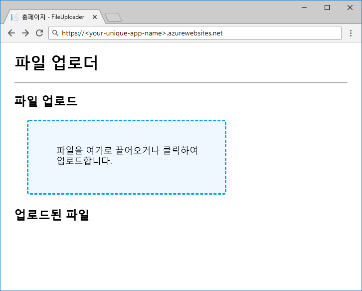

Blob에 대한 참조가 있으면 데이터를 업로드하고 다운로드할 수 있습니다. `ICloudBlob` 개체에는 바이트 배열, 스트림 및 파일을 소스 및 대상으로 지원하는 `Upload` 및 `Download` 메서드가 있습니다. 특정 유형에는 편의를 위한 추가 메서드가 있습니다. 예를 들어, `CloudBlockBlob`은 `UploadTextAsync` 및 `DownloadTextAsync`를 사용하여 문자열을 업로드하고 다운로드하는 것을 지원합니다.

## <a name="creating-new-blobs"></a>새 Blob 만들기

새 Blob을 만들려면 저장소에 존재하지 않는 Blob에 대한 참조에서 `Upload` 메서드 중 하나를 호출합니다. 이 호출은 두 가지 작업, 즉 저장소에서 Blob 만들기 및 데이터 업로드를 수행합니다.

## <a name="moving-data-to-and-from-blobs"></a>Blob 간 데이터 이동

Blob 간에 데이터를 이동하는 것은 시간이 걸리는 네트워크 작업입니다. .NET Core용 Azure Storage SDK에서는 네트워크 활동을 필요로 하는 모든 메서드가 `Task`를 반환하므로, 컨트롤러 메서드에서 `await`를 적절히 사용하는지 확인합니다.

용량이 큰 데이터 개체에 대해 작업할 때 일반적인 권장 사항은 바이트 배열 또는 문자열과 같은 메모리 내 구조 대신 스트림을 사용하는 것입니다. 이렇게 하면 대상으로 전송하기 전에 전체 콘텐츠를 메모리 내에 버퍼링하지 않습니다. ASP.NET Core는 요청 및 응답에서 스트림을 읽고 쓰는 작업을 지원합니다.

## <a name="concurrent-access"></a>동시 액세스

앱에서 Blob을 사용 중일 때 다른 프로세스가 Blob을 추가, 변경 또는 삭제하고 있을 수 있습니다. 다운로드하려고 시도할 때 Blob이 삭제되거나 예기치 않은 시기에 Blob 콘텐츠가 변경되는 등 동시성으로 인해 발생하는 문제에 대해 생각하고, 항상 방어적으로 코딩하세요. AccessConditions 및 Blob 임대를 사용하여 동시 Blob 액세스를 관리하는 방법에 대한 자세한 내용은 이 모듈 끝에 있는 추가 참고 자료 섹션을 참조하세요.

## <a name="exercise"></a>연습

업로드 및 다운로드 코드를 추가하여 앱을 완료한 후 테스트를 위해 Azure App Service에 배포하겠습니다.

### <a name="upload"></a>업로드

Blob을 업로드하기 위해, `GetBlockBlobReference`를 사용하여 컨테이너에서 `CloudBlockBlob`을 가져오는 `BlobStorage.Save` 메서드를 구현하겠습니다. `FilesController.Upload`는 파일 스트림을 `Save`에 전달하므로, 최대 효율성을 위해 `UploadFromStreamAsync`를 사용하여 업로드를 수행할 수 있습니다.

편집기에서 `BlobStorage.cs`의 `Save`를 다음 코드로 바꿉니다.

```csharp
public Task Save(Stream fileStream, string name)
{
    CloudStorageAccount storageAccount = CloudStorageAccount.Parse(storageConfig.ConnectionString);
    CloudBlobClient blobClient = storageAccount.CreateCloudBlobClient();
    CloudBlobContainer container = blobClient.GetContainerReference(storageConfig.FileContainerName);
    CloudBlockBlob blockBlob = container.GetBlockBlobReference(name);
    return blockBlob.UploadFromStreamAsync(fileStream);
}
```

> [!NOTE]
> 여기에 표시된 스트림 기반 업로드 코드는 Azure Blob Storage에 전송하기 전에 바이트 배열로 파일을 읽는 것보다 효율적입니다. 그러나 클라이언트에서 파일을 가져오는 데 사용하는 ASP.NET Core `IFormFile` 기술은 진정한 종단 간 스트리밍 구현이 아니며 작은 파일의 업로드를 처리하는 데에만 적합합니다. 완전히 스트리밍되는 파일 업로드에 대한 정보는 이 모듈의 끝부분에 있는 추가 참고 자료 섹션을 참조하세요.

### <a name="download"></a>다운로드

`BlobStorage.Load`는 `Stream`을 반환합니다. 다시 말해서, 코드가 Blob Storage에서 실제로 바이트를 이동하지 않아도 된다는 의미입니다. 그러므로 Blob 스트림에 대한 참조를 반환하기만 하면 됩니다. 그러려면 `OpenReadAsync`를 사용하면 됩니다. ASP.NET Core는 클라이언트 응답을 빌드할 때 스트림을 읽고 닫습니다.

`Load`를 다음 코드로 바꾸고 작업을 저장합니다.

```csharp
public Task<Stream> Load(string name)
{
    CloudStorageAccount storageAccount = CloudStorageAccount.Parse(storageConfig.ConnectionString);
    CloudBlobClient blobClient = storageAccount.CreateCloudBlobClient();
    CloudBlobContainer container = blobClient.GetContainerReference(storageConfig.FileContainerName);
    return container.GetBlobReference(name).OpenReadAsync();
}
```

### <a name="deploy-and-run-in-azure"></a>Azure에서 배포 및 실행

앱이 완료되었으므로, 앱을 배포하고 작동을 확인해 보겠습니다. App Service 앱을 만들고 저장소 계정 연결 문자열 및 컨테이너 이름에 대한 응용 프로그램 설정을 사용하여 구성합니다. `az storage account show-connection-string`을 사용하여 저장소 계정의 연결 문자열을 가져오고 컨테이너 이름을 `files`로 설정합니다.

앱 이름은 전역적으로 고유해야 하므로 `<your-unique-app-name>`에 입력할 자신만의 이름을 선택해야 합니다.

```azurecli
az appservice plan create --name blob-exercise-plan --resource-group <rgn>[sandbox resource group name]</rgn>
az webapp create --name <your-unique-app-name> --plan blob-exercise-plan --resource-group <rgn>[sandbox resource group name]</rgn>
CONNECTIONSTRING=$(az storage account show-connection-string --name <your-unique-storage-account-name> --output tsv)
az webapp config appsettings set --name <your-unique-app-name> --resource-group <rgn>[sandbox resource group name]</rgn> --settings AzureStorageConfig:ConnectionString=$CONNECTIONSTRING AzureStorageConfig:FileContainerName=files
```

이제 앱을 배포해 보겠습니다. 아래 명령은 사이트를 `pub` 폴더에 게시하고, `site.zip`으로 압축하고, 해당 Zip 파일을 App Service에 배포합니다.

> [!NOTE]
> 다음 명령을 실행하기 전에 셸이 `mslearn-store-data-in-azure/store-app-data-with-azure-blob-storage/src/start` 디렉터리에 있는지 확인합니다.

```azurecli
dotnet publish -o pub
cd pub
zip -r ../site.zip *
az webapp deployment source config-zip --src ../site.zip --name <your-unique-app-name> --resource-group <rgn>[sandbox resource group name]</rgn>
```

브라우저에서 `https://<your-unique-app-name>.azurewebsites.net`을 열어 실행 중인 앱을 확인합니다. 다음 이미지와 같아야 합니다.



일부 파일을 업로드하고 다운로드하여 앱을 테스트해 봅니다. 몇 개의 파일을 업로드한 후 셸에서 다음을 실행하여 컨테이너에 업로드된 Blob을 확인합니다.

```console
az storage blob list --account-name <your-unique-storage-account-name> --container-name files --query [].{Name:name} --output table
```