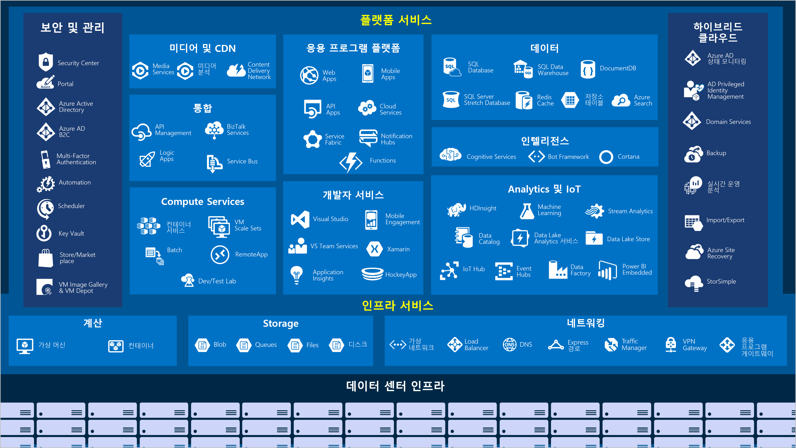
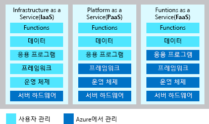

Microsoft Azure는 조직 및 기업의 비즈니스 과제를 해결하도록 돕는, 지속적으로 확장 중인 클라우드 서비스의 집합체입니다. Azure를 통해 좋아하는 도구와 프레임워크를 사용하여 대규모 글로벌 네트워크에서 응용 프로그램을 자유롭게 빌드, 관리 및 배포할 수 있습니다. Azure에서 제공하는 고급 서비스에 대해 간단히 살펴보겠습니다.

#### Azure: 큰 그림

> [!VIDEO https://www.microsoft.com/videoplayer/embed/RE2yuas]

## Azure 서비스

Azure에서는 광범위한 클라우드 기반 서비스를 제공하며, 매월 기능이 추가되고 향상됩니다. 

다음과 같이 일반적으로 사용되는 기능 몇 가지를 좀 더 자세히 살펴보겠습니다. 

- 컴퓨팅
- 네트워킹
- Storage
- 모바일
- 데이터베이스
- 웹

### 컴퓨팅

Compute Services는 기업이 Azure 플랫폼으로 이전하는 주된 이유 중 하나입니다. Azure에서는 다음을 비롯해 응용 프로그램 및 서비스를 호스트하는 다양한 옵션을 제공합니다.

Azure의 IaaS, PaaS 및 FaaS에 대한 몇 가지 예제는 다음과 같습니다.

|  형식  |  서비스 이름             | 서비스 기능                                                         |
|--------|---------------------------|--------------------------------------------------------------------------|
| IaaS   | Azure Virtual Machines    | Azure에서 호스트되는 Windows 또는 Linux VM(가상 머신)                  | 
| IaaS   | Azure Kubernetes Service  | 컨테이너화된 서비스를 실행하는 VM 클러스터를 관리할 수 있습니다.   |
| PaaS   | Azure Service Fabric      | 분산 시스템 플랫폼입니다. Azure 또는 온-프레미스에서 실행됩니다.               |
| PaaS   | Azure Batch               | 병렬 및 고성능 컴퓨팅 응용 프로그램을 위한 관리 서비스입니다. |
| PaaS   | Azure Cloud Services      | 클라우드 응용 프로그램을 실행하기 위한 관리 서비스입니다.                           |
| FaaS   | Azure Container Instances | VM 프로비전 이상의 서비스 없이도 컨테이너를 제공합니다.    |
| FaaS   | Azure Functions           | 관리 FaaS 서비스                                                     |

### 네트워킹

계산 리소스를 연결하고 응용 프로그램에 대한 액세스를 제공하는 것이 Azure 네트워킹의 주요 기능입니다. Azure의 네트워킹 기능에는 글로벌 Microsoft Azure 데이터 센터의 서비스 및 기능을 외부 환경에 연결하는 다양한 옵션이 포함되어 있습니다.

Azure 네트워킹 기능의 특성은 다음과 같습니다.

|  서비스 이름             | 서비스 기능                                                                     |
| -------------             | -------------                                                                        |
| Azure Virtual Network     | 수신 VPN(가상 사설망) 연결에 VM을 연결합니다.                   |
| Azure Load Balancer       | 응용 프로그램 또는 서비스 엔드포인트에 대한 인바운드 및 아웃바운드 연결의 균형을 맞춥니다.       |
| Azure Application Gateway | 응용 프로그램 보안을 강화하는 동시에 앱 서버 팜 제공을 최적화합니다.             |
| Azure VPN Gateway         | 고성능 VPN 게이트웨이를 통한 Azure 가상 네트워크에 액세스합니다.                |
| Azure DNS                 | 매우 빠른 DNS 응답과 매우 높은 도메인 가용성을 제공합니다.                 |
| Azure Content Delivery Network  | 전 세계 고객에게 고대역폭 콘텐츠를 제공합니다.                          |
| Azure DDoS Protection     | Azure에서 호스트되는 응용 프로그램을 DDoS(배포된 서비스 거부) 공격으로부터 보호합니다. |
| Azure Traffic Manager     | 전 세계 Azure 지역에 네트워크 트래픽을 분산합니다.                           |
| Azure ExpressRoute        | 고대역폭 전용 보안 연결을 통해 Azure에 연결합니다.                   |
| Azure Network Watcher     | 시나리오 기반 분석을 사용하여 네트워크 문제를 모니터링하고 진단합니다.                  |
| Azure Firewall            | 확장성에 제한이 없고 보안 수준이 높은 고가용성 방화벽을 구현합니다.      |
| Azure 가상 WAN         | 로컬 사이트와 원격 사이트를 연결하는 통합 WAN(광역 네트워크)을 구축합니다.         |

### Storage

Azure는 네 가지 기본 유형의 저장소 서비스를 제공합니다. 이러한 서비스는 다음과 같습니다.

- **Azure Blob Storage** - 비디오 파일이나 비트맵 같은 매우 큰 개체를 위한 저장소를 제공합니다.
- **Azure File Storage** - 파일 서버처럼 액세스하고 관리할 수 있는 파일 공유를 만듭니다.
- **Azure Queue Storage** - 응용 프로그램 간 메시지를 큐에 넣고 안정적으로 전달하기 위한 저장소를 구현합니다.
- **Azure Table Storage** - 스키마와 관계없이 비구조적 데이터를 호스트하는 NoSQL 저장소로 구성됩니다.

이러한 각 서비스는 다음과 같은 공통적인 특징을 공유하고 있습니다.

- 중복 및 복제 기능을 갖추고 있어 내구성과 가용성이 뛰어납니다.
- 자동 암호화와 역할 기반 액세스 제어를 통해 보안을 유지합니다.
- 사실상 저장소에 제한이 없으므로 확장성이 뛰어납니다.
- 유지 관리 및 사용자에 대한 중요한 문제를 관리하고 처리합니다.
- HTTP 또는 HTTPS를 통해 전 세계 어디에서든 액세스할 수 있습니다.

### 모바일

Azure를 사용하면 개발자가 선택한 개발 환경을 사용하여 빠르고 쉽게 다양한 언어로 iOS, Android 및 Windows 앱을 구축할 수 있습니다. 회사 로그인을 추가한 후에 SAP, Oracle, SQL Server, SharePoint 등의 온-프레미스 리소스에 연결하는 작업과 같이 시간이 오래 걸리고 프로젝트 위험을 높이는 기능을 이제 간단히 포함시킬 수 있습니다.

이 서비스의 다른 기능은 다음과 같습니다.

- 오프라인 데이터 동기화
- 온-프레미스 데이터 연결
- 푸시 알림 브로드캐스트
- 비즈니스 요구 사항과 일치하도록 자동 크기 조정

### 데이터베이스

Azure는 다양한 형식과 볼륨의 데이터를 저장하도록 여러 데이터베이스 서비스를 제공합니다. 사용자는 글로벌 연결을 통해 이러한 데이터를 바로 사용할 수도 있습니다.

|  서비스 이름              | 서비스 기능                                                                                |
| -------------              | -------------                                                                                   |
| Azure Cosmos DB            | NoSQL 옵션을 지원하는 전역으로 분산된 데이터베이스입니다.                                       |
| Azure SQL Database         | 자동 크기 조정과 필수 인텔리전스, 강력한 보안을 통해 완벽하게 관리되는 관계형 데이터베이스입니다.    |
| Azure Database for MySQL   | 고가용성과 보안을 제공하며 완벽하게 관리되고 확장 가능한 MySQL 관계형 데이터베이스입니다.        |
| Azure Database for PostgreSQL   | 고가용성과 보안을 제공하며 완벽하게 관리되고 확장 가능한 PostgreSQL 관계형 데이터베이스입니다.   |
| VM의 SQL Server          | 클라우드에서 엔터프라이즈 SQL Server 앱 호스트                                                    |
| Azure SQL Data Warehouse   | 추가 비용 없이 모든 수준에서 필수 보안을 제공하며 완벽하게 관리되는 데이터 웨어하우스입니다.    |
| Azure Database Migration Service    | 응용 프로그램 코드 변경 없이 클라우드로 데이터베이스를 마이그레이션합니다.                  |
| Azure Redis Cache          | 자주 사용하는 정적 데이터를 캐시하여 데이터 및 응용 프로그램 대기 시간을 줄입니다.                   |
| Azure Database for MariaDB | 고가용성과 보안을 제공하며 완벽하게 관리되고 확장 가능한 MySQL 관계형 데이터베이스입니다.        |

### 웹

Azure 웹 서비스에는 다음 기능이 포함되어 있습니다.

| 서비스 이름 | 설명 |
|--------------|-------------|
| Azure App Service | 웹 및 모바일용 강력한 클라우드 앱을 신속하게 구축할 수 있습니다. |
| Azure Notification Hubs |원하는 백 엔드에서 원하는 플랫폼으로 푸시 알림을 전송할 수 있습니다. |
| Azure API Management | 개발자, 파트너 및 직원에게 API를 안전하고 규모에 맞게 게시할 수 있습니다. |
| Azure Search | 완전히 관리되는 SaaS(Search-as-a-Service)입니다. |
| Azure App Service의 Web Apps 기능 | 중요 업무용 웹앱을 대규모로 만들고 배포할 수 있습니다. |
| Azure SignalR Service | 실시간 웹 기능을 쉽게 추가할 수 있습니다. |

Azure로 마이그레이션하려는 회사가 관심을 둘만한 영역 중 일부를 알아보았으니, 서비스와 기능을 사용하는 데 필요한 것이 무엇인지 살펴보겠습니다.
