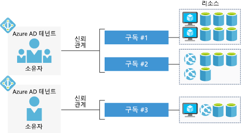

Azure 체험 계정을 사용하면 엔터프라이즈 응용 프로그램을 빌드, 테스트 및 배포하고 사용자 지정 웹 및 모바일 환경을 만들며 기계 학습 및 강력한 분석을 통해 데이터로부터 통찰력을 얻을 수 있습니다.

## Azure 계정이란?

_Azure 계정_은 특정 ID와 연결되어 있고 다음과 같은 정보를 보유합니다.

- 이름, 이메일 및 연락처 기본 설정
- 신용 카드와 같은 대금 청구 정보

Azure 계정은 하나 이상의 _구독_과 연결되어 있습니다.

## Azure 구독이란?

_Azure 구독_은 Microsoft Azure에서 리소스를 프로비전하는 데 사용되는 논리적 컨테이너입니다. 가상 머신, 데이터베이스 등 모든 리소스에 대한 세부 정보를 보유합니다. 또한 단일 Azure AD _테넌트_와 트러스트 관계를 갖습니다. 이것은 구독에 포함된 리소스에 대한 사용자 및 역할을 인증하는 데 사용됩니다.

대금 청구는 구독 수준에서 발생합니다. 월말에 놀라지 않도록 각 구독에 대한 지출 한도를 설정할 수 있습니다. 

## Azure AD 테넌트란?

Azure AD(Azure Active Directory)는 클라우드에서 응용 프로그램 및 서비스를 보호하기 위해 여러 인증 프로토콜을 지원하는 최신 ID 공급자입니다. Windows 데스크톱 및 서버 보안에 중점을 두는 Windows Active Directory와 같지 _않습니다_. 대신, Azure AD는 OpenID 및 OAuth와 같은 웹 기반 인증 표준에 관한 모든 것입니다.

단일 테넌트는 논리적 조직을 나타내며 여러 ID가 해당 테넌트에 의해 보호되는 리소스에 액세스하고 리소스를 활용할 수 있도록 합니다. Azure 구독은 항상 _단일_ Azure AD 테넌트와 트러스트 관계가 있지만 _여러_ 구독이 단일 테넌트를 공유할 수 있습니다. 이 구조를 통해 조직이 여러 구독을 관리하고 구독 내에 포함된 모든 리소스 전반에 보안 규칙을 설정할 수 있습니다.

다음은 계정, 구독, 테넌트 및 리소스를 간단하게 나타낸 것입니다.

각 Azure AD 테넌트에는 _계정 소유자_가 있습니다. 이것은 청구를 담당하는 원래 Azure 계정입니다. 테넌트에 사용자를 더 추가할 수 있으며 다른 Azure AD 테넌트의 게스트를 초대하여 구독의 리소스에 액세스할 수도 있습니다.

## Azure 계정 유형

Azure에는 여러 고객 유형에 맞는 여러 가지 계정 유형이 있습니다. 가장 일반적으로 사용되는 계정은 다음과 같습니다.

- 체험
- Pay-As-You-Go
- 기업 계약

### Azure 체험 계정

Azure 체험 계정에는 처음 30일 동안 사용할 수 있는 **$200 크레딧**, 12개월 동안 가장 인기 있는 Azure 제품에 무료로 액세스할 수 있는 권한, 항상 무료로 사용할 수 있는 25개 이상의 제품에 액세스할 수 있는 권한이 포함되어 있습니다. 신규 사용자가 시작하기에 매우 유용한 방법입니다. 체험 계정을 설정하려면 전화 번호, 신용 카드, Microsoft 계정이 필요합니다.

> [!NOTE]
> 신용 카드 정보는 ID 검증용으로만 사용됩니다. 업그레이드하기 전에는 서비스 비용이 청구되지 않습니다.

### Azure 종량제 계정

PAYG(종량제) 계정은 사용한 서비스에 대해 매월 요금이 청구됩니다. 이 계정 유형은 개인에서 중소기업 및 여러 대기업에 이르기까지 광범위한 사용자에게 적합합니다.

### Azure 기업계약

기업계약에서는 하나의 계약으로 새 라이선스와 Software Assurance에 대한 할인을 받아 클라우드 서비스 및 소프트웨어 라이선스를 유연하게 구입할 수 있습니다. 엔터프라이즈급 조직을 대상으로 합니다.

## 요약

개인이든, 중소기업이든, 대기업이든, Azure 서비스를 사용하려면 계정이 필요합니다. 일반적인 순서는 Azure 서비스를 평가할 수 있도록 체험 계정으로 시작하는 것입니다. 평가 기간이 만료되면 체험 계정에서 종량제로 변환됩니다.